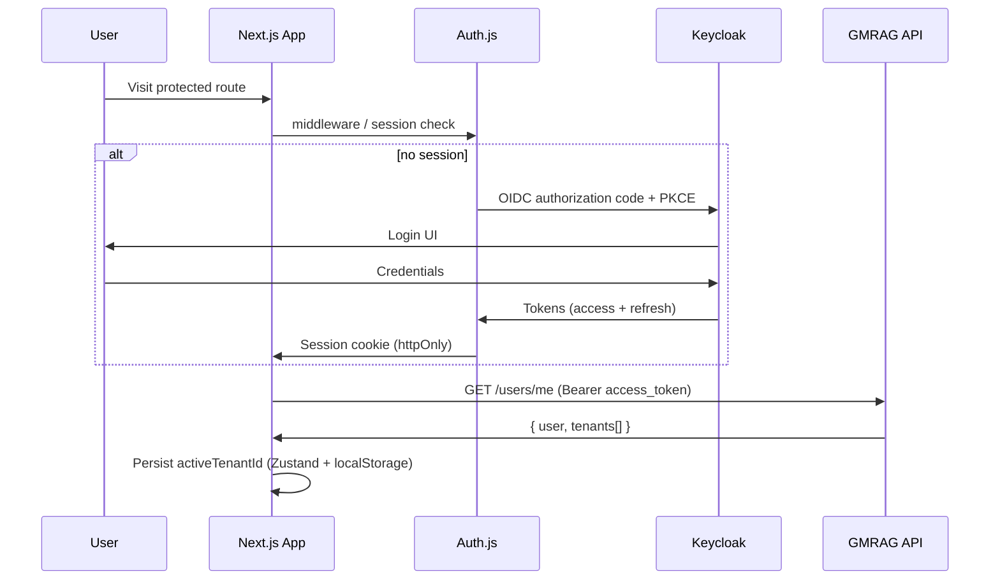

# Frontend Architecture

**Audit:** T84C — Frontend Foundation Readiness  
**Date:** 2026-06-23  
**Prerequisites:** T84A (OpenAPI), T84B (API contract audit) complete  
**Companion docs:** [API_INVENTORY.md](./API_INVENTORY.md), [FRONTEND_READINESS.md](./FRONTEND_READINESS.md)

---

## Executive summary

The GMRAG2 backend exposes a **stable, fully documented HTTP API** (34 operations, OpenAPI 3.x at `/openapi.json`). The frontend skeleton (Next.js 16 App Router, Tailwind, placeholder homepage) exists but **no application architecture is implemented yet**.

This document is the **single source of truth** for T85+ frontend work. A frontend engineer should not need to make stack, folder, auth, API, or streaming decisions independently.

**Verdict:** `FRONTEND FOUNDATION READY = YES` (conditional)

**Conditions:**

1. Accept manual Keycloak realm setup (or follow the dev guide in [Development Environment](#development-environment)).
2. Accept SSE-only chat history until `GET .../chat_sessions/{sid}/messages` lands (backend R2).
3. Run `pnpm openapi:generate` after backend is up (script defined in T85 Phase 1).

---

## Required scores

| Dimension | Score | Notes |
|-----------|------:|-------|
| OpenAPI readiness | **88%** | 34/34 ops, 58 named schemas; wire `String` vs enum drift |
| Authentication readiness | **78%** | Contract clear; audience mapper + manual Keycloak are friction |
| State management complexity | **Low (28%)** | Most state is server/cache; tiny client global slice |
| Frontend complexity | **Moderate (62%)** | Multi-tenant + ReBAC + multipart + POST-SSE |
| Streaming complexity | **High (72%)** | POST SSE with auth headers — not native `EventSource` |
| Developer experience | **68%** | Docker stack works; auth bootstrap manual |
| **Overall frontend readiness** | **82%** | GO for T85 with documented caveats |

---

## Evaluation matrix (10 decisions)

| # | Decision | Recommendation | Rationale |
|---|----------|----------------|-----------|
| 1 | Next.js App Router | **Yes** | Already scaffolded (`frontend/`, Next 16.2.9); fits tenant layouts, route groups, middleware |
| 2 | React Query | **Yes** (@tanstack/react-query v5) | 34 REST endpoints, cache/invalidation/polling for document status |
| 3 | Zustand | **Minimal yes** | Active tenant id, sidebar collapse, theme only — not server data |
| 4 | OpenAPI code generation | **Yes** | `openapi-typescript` + `openapi-fetch`; hand-written SSE + multipart wrappers |
| 5 | SSR vs CSR | **Hybrid** | SSR/middleware for auth gate; CSR for interactive tenant console |
| 6 | Server vs Client Components | **Server default, Client at boundaries** | Providers, forms, tables, chat, uploads = `"use client"` |
| 7 | Streaming architecture | **fetch-event-source** | POST SSE requires `Authorization` + `X-Tenant-Id`; native `EventSource` unusable |
| 8 | Form handling | **react-hook-form** | Settings, workspace CRUD, ACL grant form, invite member |
| 9 | Validation strategy | **zod** | Form schemas + runtime guards for API string enums |
| 10 | Chart library | **recharts** | Usage/quota dashboards; small surface area |

---

# Authentication Flow

## Backend contract (fixed — do not redesign)

| Requirement | Value |
|-------------|-------|
| IdP | Keycloak 25 (`KEYCLOAK_ISSUER_PUBLIC`) |
| Frontend client | `gmrag-frontend` (public OIDC client) |
| Backend client | `gmrag-backend` (confidential) |
| JWT issuer | `http://localhost:8080/realms/gmrag` (browser) |
| **Audience** | Must include `gmrag-backend` (validated in `jwt.rs`) |
| User identity | JWT `sub` → UUID → `users.id` (auto-provisioned) |
| Tenant scope | Header `X-Tenant-ID` (configurable via `GMRAG_TENANT_HEADER`) |
| Path rule | `{tid}` in URL **must equal** `X-Tenant-ID` |

JWT claims consumed by backend (`backend/crates/api/src/auth/jwt.rs`):

- `sub` — user UUID (required)
- `iss`, `exp`, `iat` — standard validation
- `aud` — must contain `gmrag-backend`
- `email`, `preferred_username` — user provisioning
- `realm_access.roles` — **not used for authorization** (tenant role comes from DB)

Authorization is **two-layer**:

1. **Tenant membership** — `tenant_members.role`: `owner` | `member`
2. **ReBAC** — `resource_acl` grants: `owner` (implicit), `editor`, `viewer`

Keycloak realm roles do **not** bypass API checks.

## Recommended frontend auth strategy

**Primary:** Auth.js v5 (`next-auth@5.0.0-beta.31`, already in `package.json`) with Keycloak OIDC provider.

**Do not use `keycloak-js` directly** for the main app flow unless Auth.js integration fails — having both creates duplicate token lifecycle logic. Keep `keycloak-js` only if a standalone SPA login page is required later.

### Login flow



1. User hits `/login` or is redirected from middleware.
2. Auth.js Keycloak provider performs OIDC code flow with PKCE.
3. Session stored in **httpOnly cookie** (Auth.js default).
4. Client calls `GET /users/me` with access token to bootstrap tenant list.
5. If one tenant → auto-select; if many → `/select-tenant`.

### Logout flow

1. Call Auth.js `signOut()`.
2. Optionally redirect to Keycloak end-session endpoint (`id_token_hint`).
3. Clear Zustand tenant slice + React Query cache (`queryClient.clear()`).

### Refresh strategy

| Layer | Strategy |
|-------|----------|
| Auth.js | Built-in refresh via Keycloak refresh token (configure `clientSecret` on server-side Auth route only if using confidential flow; public client uses PKCE + refresh) |
| API calls | Read fresh access token from `auth()` (server) or `useSession()` (client) per request |
| Proactive refresh | Refresh when `exp - now < 60s` before long SSE streams |

### Token storage

| Token | Storage | Never |
|-------|---------|-------|
| Access token | Auth.js session (httpOnly cookie server-side; session callback for client) | `localStorage` raw JWT |
| Refresh token | Auth.js encrypted cookie | Exposed to client JS |
| Active tenant UUID | `localStorage` key `gmrag:activeTenantId` + Zustand | JWT claim (no tenant in token) |

### Auth guards

| Guard | Location | Behavior |
|-------|----------|----------|
| Session guard | `middleware.ts` | Redirect unauthenticated users to `/login` |
| Tenant guard | `app/t/[tid]/layout.tsx` | Verify `tid` ∈ user's tenants from `/users/me`; redirect to `/select-tenant` |
| Owner guard | Feature components | Hide settings/usage/member-mgmt unless `role === "owner"` |
| ReBAC guard | Feature components | Disable share/delete based on 403 vs 404 from API (optimistic UI only — backend is source of truth) |

### Route protection

| Route class | Examples | Auth |
|-------------|----------|------|
| Public | `/login`, `/api/auth/*`, `/api/health` | None |
| Authenticated (no tenant) | `/select-tenant`, `/tenants/new` | JWT only |
| Tenant-scoped | `/t/[tid]/**` | JWT + `X-Tenant-ID` |
| Owner-only UI | `/t/[tid]/settings`, `/t/[tid]/usage` | JWT + tenant + client-side owner check |

### Compatibility

| Mode | Compatible | Notes |
|------|:----------:|-------|
| SPA | Yes | Primary mode — tenant console is client-heavy |
| SSR | Partial | Auth gate + initial `/users/me` can run server-side via `auth()` |
| Next.js Middleware | Yes | Session cookie check before route handlers |

---

# API Client

## Option analysis

| Option | Verdict | Reason |
|--------|---------|--------|
| **A — openapi-typescript** | **Selected (types)** | Zero runtime, stable schema names, pairs with fetch |
| **B — orval** | Rejected | Generates axios + hooks — duplicates React Query patterns; heavier |
| **C — Custom SDK** | Partial | `lib/acl.ts` pattern for SSE/multipart only |
| **D — openapi-fetch** | **Selected (transport)** | Typed paths from generated `paths` interface |

## Recommended stack

```
openapi-typescript  →  src/lib/api/schema.d.ts (generated, committed or CI)
openapi-fetch       →  src/lib/api/client.ts (typed fetch wrapper)
hand-written        →  src/lib/api/sse.ts, upload.ts, errors.ts
```

## Client structure

```
frontend/src/lib/api/
├── schema.d.ts          # generated — DO NOT EDIT
├── client.ts            # createClient<paths>() + middleware
├── errors.ts            # parseApiError(), parseSseError()
├── headers.ts           # buildAuthHeaders(session, tenantId)
├── upload.ts            # multipart document upload (not in openapi-fetch)
├── sse.ts               # postChatStream() via @microsoft/fetch-event-source
└── index.ts             # re-exports
```

## `apiFetch` contract (extends T84 `acl.ts` pattern)

Every tenant-scoped call must attach:

```http
Authorization: Bearer <access_token>
X-Tenant-ID: <uuid>
Content-Type: application/json
```

Error parsing (HTTP):

```typescript
type ApiErrorBody = { error: { code: string; message: string } };
```

Success bodies use **domain keys** — never assume `{ data: T }`. See [API_INVENTORY.md](./API_INVENTORY.md) cheat sheet.

## Domain wrapper modules

Thin modules over generated client (mirror existing `lib/acl.ts`):

| Module | Endpoints |
|--------|-----------|
| `lib/tenants.ts` | `/tenants`, `/tenants/{tid}` |
| `lib/workspaces.ts` | workspaces CRUD + members |
| `lib/documents.ts` | list, upload, preview, delete |
| `lib/chat.ts` | sessions CRUD + SSE stream |
| `lib/settings.ts` | LLM BYOK |
| `lib/metering.ts` | usage, quotas, audit logs |
| `lib/acl.ts` | **exists** — keep as reference implementation |

---

# OpenAPI Codegen

## Phase 1 audit results

| Check | Result |
|-------|--------|
| Code generation possible? | **Yes** |
| Schema names stable? | **Yes** — PascalCase Rust → same in components (`DocumentItem`, `MeResponse`, …) |
| Duplicate schemas? | **No** — `schemas.rs` enforces unique names |
| Anonymous objects? | **Minimal** — `GraphNodeItem.properties` is `serde_json::Value` → generic `Record<string, unknown>` |
| Enums usable in TypeScript? | **Partial** — OpenAPI enums exist (`DocumentStatus`, `AclRelation`) but wire fields are often `string` |
| Response envelopes | **Per-route** — no global wrapper |
| Nullable fields | **Correct** — Rust `Option<T>` → nullable in spec (`workspace_id`, `model`, `api_key_masked`, …) |

## Tags (12 groups — map to feature folders)

Health, Users, Tenants, TenantMembers, Workspaces, WorkspaceMembers, Documents, ACL, Chat, Graph, Settings, Metering

## Codegen friction points

| Issue | Severity | Frontend action |
|-------|----------|-----------------|
| `ChatSseEvent` tagged union | Low | Generates discriminated union — use `type` narrowing |
| Multipart upload | Medium | Hand-write `upload.ts`; OpenAPI documents fields but tools struggle with binary |
| SSE POST operation | Medium | Exclude from generated client; custom `sse.ts` |
| String vs enum on wire | Medium | Add `lib/api/enums.ts` zod schemas for runtime validation |
| 204 DELETE responses | Low | openapi-fetch handles empty body |
| Dual DTO source (handler + schemas.rs) | Low (drift risk P3) | Regenerate types in CI when backend changes |

## Frontend SDK difficulty: **Moderate**

- **Easy:** CRUD JSON endpoints, error envelope, UUID/date types
- **Moderate:** Enum string drift, multipart, POST-SSE, per-route response keys
- **Hard:** Nothing blocking — no anonymous operation objects or name collisions

## Generation script (T85 Phase 1)

```json
"openapi:generate": "openapi-typescript http://localhost:8088/openapi.json -o src/lib/api/schema.d.ts"
```

Run when backend is up, or snapshot spec to `docs/openapi.snapshot.json` for offline CI.

---

# Query Layer

## Library: @tanstack/react-query v5

All server data lives in React Query. **No Redux, no server data in Zustand.**

## Query key factory

```typescript
// src/lib/query/keys.ts
export const queryKeys = {
  me: ["me"] as const,

  tenants: {
    all: ["tenants"] as const,
    detail: (tid: string) => ["tenants", tid] as const,
  },

  members: (tid: string) => ["tenants", tid, "members"] as const,

  workspaces: {
    list: (tid: string) => ["tenants", tid, "workspaces"] as const,
    detail: (tid: string, wid: string) => ["tenants", tid, "workspaces", wid] as const,
    members: (tid: string, wid: string) => ["tenants", tid, "workspaces", wid, "members"] as const,
    graph: (tid: string, wid: string) => ["tenants", tid, "workspaces", wid, "graph"] as const,
  },

  documents: {
    list: (tid: string, workspaceId?: string) =>
      workspaceId
        ? (["tenants", tid, "documents", { workspaceId }] as const)
        : (["tenants", tid, "documents"] as const),
    preview: (tid: string, did: string) => ["tenants", tid, "documents", did, "preview"] as const,
  },

  chat: {
    sessions: (tid: string) => ["tenants", tid, "chat_sessions"] as const,
    session: (tid: string, sid: string) => ["tenants", tid, "chat_sessions", sid] as const,
    // messages: deferred until backend endpoint exists
  },

  acl: {
    grants: (tid: string, resourceType: string, resourceId: string) =>
      ["tenants", tid, "acl", resourceType, resourceId] as const,
  },

  settings: {
    llm: (tid: string) => ["tenants", tid, "settings", "llm"] as const,
  },

  metering: {
    usage: (tid: string) => ["tenants", tid, "metering", "usage"] as const,
    quotas: (tid: string) => ["tenants", tid, "quotas"] as const,
    auditLogs: (tid: string) => ["tenants", tid, "audit_logs"] as const,
  },
};
```

## Invalidation map

| Mutation | Invalidate |
|----------|------------|
| Create/delete tenant | `queryKeys.tenants.all`, `queryKeys.me` |
| Invite/remove member | `queryKeys.members(tid)` |
| Workspace CRUD | `queryKeys.workspaces.list(tid)` |
| Document upload | `queryKeys.documents.list(tid, wid)`, `queryKeys.metering.quotas(tid)` |
| Document delete | `queryKeys.documents.list(tid)` |
| ACL grant/revoke | `queryKeys.acl.grants(tid, type, id)` |
| Chat session create/delete | `queryKeys.chat.sessions(tid)` |
| LLM settings PUT | `queryKeys.settings.llm(tid)` |

## Polling

| Query | Interval | Stop when |
|-------|----------|-----------|
| `documents.list` | 5s | All docs `status === "indexed"` or `"failed"` |
| `documents.preview` | None | Manual refetch after upload |

## Optimistic updates

| Action | Strategy |
|--------|----------|
| Delete document/session | Optimistic remove from list cache |
| Create workspace | Optimistic append (rollback on error) |
| ACL revoke | Optimistic filter grant list |
| Chat message send | Append user message locally; stream assistant response |

## SSE handling

Not React Query — use `useChatStream` hook with local reducer state. Invalidate `chat.sessions(tid)` on `done` event (updates `updated_at`).

---

# State Management

## Global client state (Zustand — one store)

```typescript
// src/lib/store/app-store.ts
interface AppStore {
  activeTenantId: string | null;
  setActiveTenantId: (id: string) => void;
  sidebarCollapsed: boolean;
  toggleSidebar: () => void;
  theme: "light" | "dark" | "system";
  setTheme: (t: AppStore["theme"]) => void;
}
```

Persist `activeTenantId` to `localStorage` via Zustand `persist` middleware.

## React Context (thin wrappers)

| Context | Purpose |
|---------|---------|
| `AuthSessionProvider` | Auth.js `SessionProvider` |
| `QueryProvider` | React Query client |
| `ApiConfigProvider` | `{ baseUrl, tenantId, getToken }` derived from session + Zustand |

## Explicitly rejected

| Library | Reason |
|---------|--------|
| Redux / MobX | No complex client state graph |
| Jotai / Recoil | Zustand sufficient for 4 fields |
| Server data in Zustand | React Query owns all API data |

## State management complexity score: **Low (28%)**

---

# SSE Strategy

## Backend behavior (fixed)

- **Endpoint:** `POST /tenants/{tid}/chat_sessions/{sid}/chat`
- **Content-Type:** `text/event-stream`
- **Body:** `{ "message": "..." }`
- **Events:** JSON lines with `"type"` discriminator

| `type` | Payload |
|--------|---------|
| `text` | `{ content }` |
| `citation` | `{ index, point_id, document_id, chunk_index, filename? }` |
| `citation_unknown` | `{ index }` |
| `done` | `{ finish_reason? }` |
| `error` | `{ code, message }` — **not** nested under `error` key |

Pre-stream failures: standard HTTP `{ error: { code, message } }`.

In-stream codes: `stream-failed`, `persist-failed`.

## Critical constraint: native EventSource is unusable

| Limitation | Impact |
|------------|--------|
| EventSource is GET-only | Chat is POST |
| No custom headers | Cannot send `Authorization` or `X-Tenant-ID` |

## Recommended architecture

**Library:** `@microsoft/fetch-event-source`

```
src/lib/api/sse.ts
  postChatStream(config, sid, message, handlers, signal)

src/hooks/use-chat-stream.ts
  - Manages AbortController per message
  - Reducer: messages[], streamingText, citations[], status
  - Parses ChatSseEvent discriminated union

src/features/chat/components/chat-panel.tsx
  - Consumes useChatStream
```

### Reconnect behavior

| Scenario | Behavior |
|----------|----------|
| Network blip mid-stream | **Do not auto-reconnect** — show error, let user retry send |
| Tab background | Continue stream until `done` or abort on unmount |
| New message while streaming | Abort previous `AbortController` |

### Cancellation

Pass `AbortSignal` to `fetchEventSource`. On component unmount or new send → `abort()`.

### Partial tokens

Append `text.content` to `streamingText` buffer; on `done`, commit as assistant message bubble.

### Error handling

```typescript
function parseSsePayload(json: unknown): ChatSseEvent {
  // narrow on json.type
}
// HTTP errors → parseApiError()
// SSE type=error → parseSseError() — separate code path
```

## Streaming complexity score: **High (72%)**

---

# Route Structure

```
app/
├── layout.tsx                          # fonts, globals, providers
├── page.tsx                            # redirect → /t/{tenant}/dashboard or /login
├── login/page.tsx                      # public
├── select-tenant/page.tsx              # authenticated, no tenant header
│
├── t/[tid]/
│   ├── layout.tsx                      # tenant guard, shell chrome
│   ├── dashboard/page.tsx
│   ├── documents/page.tsx
│   ├── documents/[did]/page.tsx        # preview + share
│   ├── chat/page.tsx                   # session list
│   ├── chat/[sid]/page.tsx             # chat panel + SSE
│   ├── workspaces/page.tsx
│   ├── workspaces/[wid]/page.tsx
│   ├── workspaces/[wid]/graph/page.tsx
│   ├── settings/page.tsx               # owner only
│   ├── settings/members/page.tsx       # owner only
│   ├── settings/llm/page.tsx           # owner only
│   └── usage/page.tsx                  # owner: usage + quotas + audit
│
└── api/
    ├── auth/[...nextauth]/route.ts
    └── health/route.ts                 # exists
```

## Route classes

| Path prefix | Guard |
|-------------|-------|
| `/login` | Public |
| `/select-tenant` | Auth session |
| `/t/[tid]/*` | Auth + tenant membership |
| `/t/[tid]/settings/*`, `/usage` | Auth + tenant + **owner role** (UI gate) |

---

# Folder Structure

```
frontend/
├── app/                          # Next.js App Router pages only
├── components/
│   ├── ui/                       # shadcn primitives (button, dialog, …)
│   └── layout/                   # shell, sidebar, header, tenant-switcher
├── features/
│   ├── auth/
│   ├── tenants/
│   ├── workspaces/
│   ├── documents/
│   ├── chat/
│   ├── acl/                      # move AclShareDialog here from components/
│   ├── settings/
│   ├── graph/
│   └── usage/
├── hooks/
│   ├── use-api-config.ts
│   ├── use-tenant.ts
│   ├── use-chat-stream.ts
│   └── use-is-owner.ts
├── lib/
│   ├── api/                      # generated + client + sse + upload
│   ├── auth/                     # auth.ts, middleware helpers
│   ├── query/                    # keys.ts, provider.tsx
│   └── store/                    # app-store.ts (Zustand)
└── types/                        # UI-only types not in OpenAPI
```

---

# Component Architecture

## Layer rules

| Layer | Contains | Imports from |
|-------|----------|--------------|
| `components/ui/` | Presentational, no API calls | Radix/shadcn only |
| `components/layout/` | Shell, nav | hooks, store |
| `features/*/` | Domain screens + feature components | lib/api, hooks, ui |
| `hooks/` | Reusable stateful logic | lib |
| `lib/` | Framework-agnostic utilities | nothing from features |

## Reusable components (build in T85)

| Component | Feature |
|-----------|---------|
| `TenantSwitcher` | layout |
| `WorkspacePicker` | documents, chat |
| `DataTable` | ui + TanStack Table |
| `EmptyState`, `ErrorBanner` | ui |
| `ConfirmDialog` | ui |
| `UploadDropzone` | documents |
| `DocumentStatusBadge` | documents |
| `ChatMessageList`, `ChatInput` | chat |
| `CitationChip` | chat |
| `AclShareDialog` | **exists** — relocate to `features/acl/` |
| `LlmSettingsForm` | settings |
| `QuotaBar` | usage |
| `UsageChart` | usage |
| `KnowledgeGraphView` | graph (react-force-graph or vis-network) |
| `AuditLogTable` | usage |

## Feature boundaries

Each feature exports:

- `pages` — not exported (live in `app/`)
- `{Feature}View` — main screen component
- `use{Feature}*` hooks — React Query wrappers
- No cross-feature imports except through `lib/` and `components/ui/`

## API hooks pattern

```typescript
// features/documents/hooks/use-documents.ts
export function useDocuments(tid: string, workspaceId?: string) {
  const config = useApiConfig();
  return useQuery({
    queryKey: queryKeys.documents.list(tid, workspaceId),
    queryFn: () => listDocuments(config, workspaceId),
    refetchInterval: (q) => hasProcessingDocs(q.state.data) ? 5000 : false,
  });
}
```

---

# Form Strategy

## Stack

- **react-hook-form** — form state, performance
- **zod** — schema validation
- **@hookform/resolvers/zod** — bridge

## Forms by screen

| Form | Schema highlights |
|------|-------------------|
| Create tenant | `{ name: z.string().min(1).max(128) }` |
| Create workspace | `{ name, slug: z.string().regex(/^[a-z0-9-]+$/) }` |
| Invite member | `{ email: z.string().email(), role: z.enum(["member","owner"]).optional() }` |
| Upload document | `{ file: File, visibility: z.enum(["shared","private"]), workspace_id: z.string().uuid(), title?: string }` |
| ACL grant | `{ principal_type, principal_id: uuid, relation: z.enum(["viewer","editor"]) }` |
| LLM settings | `{ provider: z.enum(["ollama","openai"]), model, base_url?, api_key?, … }` |
| Chat message | `{ message: z.string().min(1) }` |

## API error display

Map `error.code` to field errors where applicable (`bad-request` → form root error). Never match on `message` substring.

---

# Chart Strategy

## Library: recharts

| Chart | Data source |
|-------|-------------|
| Usage bar chart | `GET .../metering/usage` → `{ metric, total }[]` |
| Quota utilization | `GET .../quotas` vs usage totals |
| Storage gauge | `max_storage_bytes` vs document byte sum from usage |

Keep charts in `features/usage/components/`. Owner-only route.

Alternative for graph visualization (not charts): **react-force-graph-2d** or **@xyflow/react** for `WorkspaceGraphResponse`.

---

# Design System

## Current state

| Asset | Status |
|-------|--------|
| Tailwind CSS 3.4 | Installed, minimal config |
| shadcn/ui | **Not installed** |
| Icons (lucide-react) | **Not installed** |
| Charts | **Not installed** |
| Forms libs | **Not installed** |
| `AclShareDialog` | Plain HTML + Tailwind (pre-shadcn) |

## Recommended component library: shadcn/ui

Init in T85 Phase 1:

```bash
pnpm dlx shadcn@latest init
pnpm dlx shadcn@latest add button dialog input select table tabs badge toast dropdown-menu sheet
```

## Theming

- CSS variables in `globals.css` (shadcn default)
- Dark mode via `next-themes` + Zustand/system preference
- Tenant branding: **out of scope** for MVP

## Design system readiness score: **35%** (Tailwind only)

---

# Development Environment

## Clone-to-work checklist

| Step | Works? | Notes |
|------|:------:|-------|
| `cp .env.example .env` | Yes | |
| `docker compose -f infra/docker-compose.yml up -d` | Yes | 9 services |
| API at `:8088` | Yes | Maps container 8080 |
| Swagger at `:8088/swagger` | Yes | |
| OpenAPI at `:8088/openapi.json` | Yes | |
| Frontend at `:3000` | Yes | Placeholder only |
| CORS for `:3000` | Yes | T84B middleware |
| Keycloak realm auto-import | **No** | Manual setup required |
| Dev JWT in repo | **No** | |
| Seed data ↔ Keycloak UUID alignment | **No** | `seed.sql` UUIDs ≠ Keycloak `sub` |
| `pnpm install && pnpm dev` | Yes | Needs Node 20+ |

## Keycloak setup (required for E2E)

1. Open `http://localhost:8080` → admin console.
2. Create realm `gmrag`.
3. Create client `gmrag-backend` (confidential) — match `KEYCLOAK_CLIENT_SECRET`.
4. Create client `gmrag-frontend` (public, PKCE, valid redirect `http://localhost:3000/*`).
5. Add **Audience mapper** on `gmrag-frontend` so access tokens include `aud: gmrag-backend`.
6. Create test user; note UUID from Keycloak user ID equals JWT `sub`.

## Environment variables (frontend)

| Variable | Purpose |
|----------|---------|
| `NEXT_PUBLIC_API_BASE_URL` | `http://localhost:8088` |
| `NEXT_PUBLIC_KEYCLOAK_URL` | `http://localhost:8080` |
| `NEXT_PUBLIC_KEYCLOAK_REALM` | `gmrag` |
| `NEXT_PUBLIC_KEYCLOAK_CLIENT_ID` | `gmrag-frontend` |
| `NEXT_PUBLIC_TENANT_HEADER` | `X-Tenant-ID` |
| `AUTH_SECRET` | Auth.js encryption (server) |
| `AUTH_KEYCLOAK_ID` | Same as frontend client id |
| `AUTH_KEYCLOAK_SECRET` | Only if confidential client |
| `AUTH_KEYCLOAK_ISSUER` | `http://localhost:8080/realms/gmrag` |

## Friction points

| Friction | Mitigation (T85 Phase 1) |
|----------|--------------------------|
| Manual Keycloak | Add `docs/KEYCLOAK_DEV_SETUP.md` + optional realm JSON import |
| No example tokens | Document Swagger Authorize flow |
| Seed ≠ Keycloak IDs | Document "create tenant via API after login" path |
| `eslint-config-next` 16 vs description drift | Fix package.json metadata in Phase 1 |
| SQLX_OFFLINE for backend tests | Document for contributors |

---

# Risks

| ID | Risk | Severity | Mitigation |
|----|------|----------|------------|
| R1 | POST SSE cannot use EventSource | P0 | `@microsoft/fetch-event-source` (documented above) |
| R2 | Manual Keycloak setup | P1 | Dev setup doc + CI mock option |
| R3 | No chat messages list API | P1 | Client-side SSE accumulation only; disable history reload |
| R4 | Unpaginated lists | P2 | Simple tables; no virtual scroll yet |
| R5 | 403 vs 404 ReBAC semantics | P2 | Uniform "not found or no access" copy |
| R6 | Dual error shapes (HTTP vs SSE) | P2 | Two parsers in `errors.ts` |
| R7 | String enum drift | P2 | Zod runtime enums in `lib/api/enums.ts` |
| R8 | No invitation accept API | P2 | Defer invite acceptance UI |
| R9 | Audit log 100-row cap | P3 | Show "Showing latest 100" banner |
| R10 | OpenAPI handler drift | P3 | CI regen + diff check |

---

# Recommended Stack

| Layer | Choice |
|-------|--------|
| Framework | **Next.js 16 App Router** |
| Language | **TypeScript 5.6** |
| Styling | **Tailwind CSS 3.4** |
| Components | **shadcn/ui** (Radix primitives) |
| Icons | **lucide-react** |
| Auth | **Auth.js v5** (Keycloak provider) |
| API types | **openapi-typescript** |
| API transport | **openapi-fetch** + custom SSE/upload |
| Server state | **TanStack React Query v5** |
| Client state | **Zustand** (minimal) |
| Forms | **react-hook-form + zod** |
| Charts | **recharts** |
| SSE | **@microsoft/fetch-event-source** |
| Graph viz | **@xyflow/react** (or react-force-graph-2d) |
| Tables | **@tanstack/react-table** |
| Toasts | **sonner** (via shadcn) |

---

# T85 Roadmap

See [T85_IMPLEMENTATION_PLAN.md](./T85_IMPLEMENTATION_PLAN.md) for phased delivery.

**Recommended implementation order:**

1. Foundation — tooling, shadcn, OpenAPI codegen, query provider, folder structure
2. Authentication — Auth.js, middleware, login, session
3. Dashboard shell — tenant layout, sidebar, tenant switcher
4. Settings — LLM BYOK, members (owner)
5. ACL — mount existing `AclShareDialog`
6. Documents — list, upload, preview, polling
7. Chat — sessions, SSE stream, citations
8. Usage — quotas, usage charts, audit log

---

## Final outputs (quick reference)

| # | Recommendation |
|---|----------------|
| 1 | Stack: Next.js 16 + Auth.js + React Query + Zustand (minimal) + shadcn |
| 2 | Folders: `app/`, `features/`, `components/ui/`, `lib/api/`, `hooks/` |
| 3 | API client: `openapi-typescript` + `openapi-fetch` + `lib/acl.ts` pattern |
| 4 | Auth: Auth.js Keycloak OIDC, httpOnly session, Bearer passthrough, audience `gmrag-backend` |
| 5 | State: Zustand for tenant UI prefs only |
| 6 | Query: TanStack React Query v5 with `queryKeys` factory |
| 7 | Components: shadcn/ui |
| 8 | Forms: react-hook-form + zod |
| 9 | Charts: recharts |
| 10 | T85 order: Foundation → Auth → Shell → Settings → ACL → Documents → Chat → Usage |

---

*Audit task: T84C. Prior: [T84A](./progress/T84A.md), [T84B](./FRONTEND_READINESS.md).*
