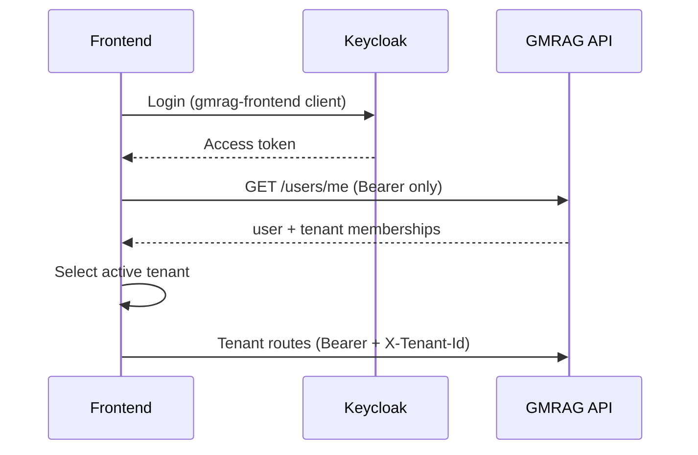

# Frontend Readiness Report (T84B)

**Date:** 2026-06-23  
**Scope:** Final pre-frontend API contract audit  
**Companion:** [API_INVENTORY.md](./API_INVENTORY.md)  
**OpenAPI:** T84A complete — `/openapi.json`, `/swagger`

---

# API Stability

The production API surface is **stable and fully documented**. All 34 HTTP handlers are registered in `backend/crates/api/src/lib.rs` and annotated with `#[utoipa::path]` (verified by `cargo test -p gmrag-api --test openapi`).

| Aspect | Status |
|--------|--------|
| Route count vs OpenAPI | 34 / 34 match |
| Breaking path changes since T84A | None |
| Undocumented handlers | 0 |
| Auth model | Fixed 3-tier (public / JWT / JWT+tenant+RLS) |
| Permission semantics | Documented (tenant role + ReBAC) |

**Frontend implication:** Generate TypeScript types from `/openapi.json`. Do not assume a generic response wrapper — parse per-route schemas listed in [API_INVENTORY.md](./API_INVENTORY.md).

**Stability gaps (non-breaking):**

- List endpoints return full result sets (scaling risk at large tenants)
- No `GET .../chat_sessions/{sid}/messages` for chat history reload
- Invitation accept flow not implemented (invite returns token only)

---

# Error Contract

## Current shape (HTTP JSON)

All standard HTTP errors use a single envelope defined in `backend/crates/api/src/error.rs`:

```json
{
  "error": {
    "code": "kebab-case",
    "message": "human-readable string"
  }
}
```

## Status code usage

| Status | Used | Machine-readable codes |
|--------|:----:|------------------------|
| 400 | Yes | `bad-request` |
| 401 | Yes | `missing-header`, `invalid-token`, `user-not-found` |
| 403 | Yes | `forbidden` |
| 404 | Yes | `not-found` (includes intentional authz hide) |
| 409 | **No** | Conflicts → 400 or 500 |
| 422 | **No** | Validation → 400 |
| 429 | Yes | `quota-exceeded` |
| 500 | Yes | `internal-error`, `database-error`, middleware codes |
| 503 | Yes | `jwks-fetch-failed`, `rls-connection-failed`, healthz degraded |

## Frontend error handling guide

1. **Parse uniformly:** `const { code, message } = body.error`
2. **Branch on `code`**, not message text (messages may include prefixes like `"bad request: ..."`)
3. **403 vs 404:** Do not infer resource existence from 404 on viewer-gated reads
4. **SSE chat:** Handle separately — see below

## Inconsistencies

| Issue | Severity | FE action |
|-------|----------|-----------|
| SSE errors use `{ type: "error", code, message }` not nested `error` | P2 | Separate parser for EventSource |
| `/healthz` 503 uses `{ status, db }` | P3 | Health probes only |
| Middleware codes (`rls-*`, `tenant-missing-*`) not in OpenAPI enum | P3 | Extend error map from inventory appendix |
| Message prefix inconsistency across layers | P3 | Never match on message substring |

## Recommended standard (for new endpoints)

Keep the existing HTTP envelope. For SSE, document tagged events with `type` discriminator (already in OpenAPI `ChatSseEvent`).

**Error consistency score: 92%** (11/12 JSON error paths use standard envelope; SSE + healthz are exceptions)

---

# Response Shapes

## No unified envelope

Success responses use **domain-named keys**, not `{ "data": ... }`:

| Pattern | Example key(s) | Routes |
|---------|----------------|--------|
| Collection wrapper | `tenants`, `documents`, `sessions`, `members`, `grants`, `logs`, `usage`, `workspaces` | List GETs |
| Composite | `user` + `tenants` | `/users/me` |
| Composite | `document` + `chunks` | preview |
| Composite | `nodes` + `edges` | graph |
| Flat object | (root fields) | settings, quotas |
| Minimal create | `{ id }` | document upload, chat session create |
| Full create | full entity | workspace, tenant, ACL grant, invitation |

## Create-response inconsistency

| Endpoint | 201 body |
|----------|----------|
| POST documents | `{ id }` |
| POST chat_sessions | `{ id }` |
| POST tenants | `{ id, name, role }` |
| POST workspaces | full workspace fields |
| POST acl | full grant object |

**FE recommendation:** Use OpenAPI response schema per operation; do not share a generic `CreateResponse` type.

## Enum drift

OpenAPI defines `DocumentStatus`, `DocumentVisibility`, `AclResourceType`, etc. in `schemas.rs`, but wire fields are often `String`. Treat allowed values as documented unions in generated TS types; do not rely on runtime enum validation.

## Duplicated DTO definitions

`LlmSettingsResponse` and `QuotaResponse` exist in both route handlers and `openapi/schemas.rs`. Shapes match today; drift risk is P3.

**Response predictability score: 80%** (consistent per-route, inconsistent cross-route conventions)

---

# Pagination

| Endpoint type | Behavior |
|---------------|----------|
| All list GETs | Full `fetch_all` — no `limit`, `cursor`, or `offset` |
| Audit logs | Hardcoded `LIMIT 100`, newest first — not exposed to client |
| Document preview chunks | Hardcoded 50 chunks — not paginated |
| Chat messages | **No list endpoint** (future R2) |

## Recommended standard (future endpoints)

```
GET ...?limit=20&cursor=<opaque>
→ { "items": [...], "next_cursor": "...", "has_more": true }
```

## Frontend assumptions for MVP

- Treat list responses as complete except audit logs (silently capped at 100)
- Do not build infinite-scroll UX on documents/sessions/graph without backend pagination
- Chat history UI blocked until `GET .../messages` or client-side-only SSE accumulation

**Pagination readiness: 40%** (functional for small tenants; not scalable)

---

# Filtering

## Client query parameters (only 2 endpoints)

| Endpoint | Parameters | Required |
|----------|------------|----------|
| `GET .../documents` | `workspace_id` (UUID) | Optional |
| `GET .../acl` | `resource_type`, `resource_id` | Both required |

## Notable gaps

- No `workspace_id` filter on `GET .../chat_sessions` (documents have it; sessions do not)
- No audit log filters (date, action, actor)
- No text search on any resource

## Sorting

All sort order is **server-fixed**; no client `sort` or `order` params.

| Endpoint | ORDER BY |
|----------|----------|
| Documents | `created_at DESC` |
| Chat sessions | `updated_at DESC` |
| Tenants | `created_at ASC` |
| Workspaces | `created_at ASC` |
| Members | `email ASC` |
| ACL grants | `created_at ASC` |
| Graph | `created_at ASC` |
| Usage | `metric ASC` |
| Audit logs | `created_at DESC` |

**Filtering readiness: 50%** (minimal but documented)

---

# Authentication

## Required headers

```http
Authorization: Bearer <Keycloak access token>
Content-Type: application/json          # JSON bodies
X-Tenant-Id: <uuid>                     # All /tenants/{tid}/... routes
```

Header name configurable via `GMRAG_TENANT_HEADER` (default `X-Tenant-ID`).

## Bootstrap flow



## JWT requirements

- **Issuer:** `KEYCLOAK_ISSUER` (e.g. `http://localhost:8080/realms/gmrag`)
- **Audience:** must include `gmrag-backend` (not just frontend client)
- Configure Keycloak audience mapper so frontend-obtained tokens validate

## Permission model (two layers)

### Tenant membership (`tenant_members.role`)

| Role | Capabilities |
|------|--------------|
| `owner` | Tenant admin: settings, metering, member mgmt, patch/delete tenant |
| `member` | Use tenant resources subject to ReBAC |

### ReBAC (`resource_acl` + ownership columns)

| Relation | Grantable via ACL | Notes |
|----------|:-----------------:|-------|
| `owner` | No | Implicit from `owner_id` / session `user_id` |
| `editor` | Yes | Implies elevated write access |
| `viewer` | Yes | Read access; workspace members inherit on child resources |
| `member` | No | From `workspace_members` table |

## Critical FE gotchas

1. Path `{tid}` must match `X-Tenant-Id` or API returns 400
2. No global `X-Workspace-Id` — pass workspace in path, query, or body
3. `403` on owner-only writes; `404` on denied viewer reads — design UI copy accordingly
4. `platform_admins` table exists but has no API bypass

---

# OpenAPI Readiness

| Aspect | Assessment |
|--------|------------|
| Implementation | **Complete** (T84A) |
| Coverage | 34/34 operations |
| Swagger UI | `/swagger` (public) |
| Security scheme | Bearer JWT (`bearer_auth`) |
| Tags | 12 domain groups |
| SSE / multipart | Documented with known Swagger UI limitations |
| Examples | Missing (P3) |
| Global `X-Tenant-Id` param | Per-path only (P3) |
| Single Rust source for DTOs | Dual source (handler + schemas.rs) |

**Swagger implementation difficulty: Easy** (already shipped)

**Remaining effort: Moderate** for TypeScript client generation, request/response examples, `OPENAPI_ENABLED` prod toggle, typed handler responses as single source.

---

# Developer Experience

## Clone-to-work checklist

| Step | Status | Notes |
|------|--------|-------|
| `cp .env.example .env && docker compose up` | Works | 9 services via `infra/docker-compose.yml` |
| API reachable | Works | `http://localhost:8088` (host port → container 8080) |
| DB migrations | Auto | On backend boot |
| Swagger | Works | `http://localhost:8088/swagger` |
| Seed data | Manual | `infra/postgres/seed.sql` — UUIDs ≠ Keycloak `sub` |
| Keycloak realm | **Manual** | No realm import script in repo |
| Dev JWT / test tokens | **None committed** | Rust test keys for unit tests only |
| Frontend auth (T70) | **Not built** | Placeholder homepage |
| CORS | **Implemented** (T84B) | Reads `CORS_*` env vars via `middleware/cors.rs` |
| `.env.example` API URL | Fixed in T84B | Was `:8080` (Keycloak), now `:8088` |

## Practical paths for frontend developers

| Approach | Effort |
|----------|--------|
| OpenAPI + Swagger with manual Keycloak token | Medium |
| Next.js API route proxy (bypass CORS) | Medium |
| Mock server from `/openapi.json` | Low (no auth E2E) |
| Align Keycloak user UUIDs with seed.sql | High manual |

## Keycloak setup (required for E2E)

1. Create realm `gmrag`
2. Clients: `gmrag-backend` (confidential), `gmrag-frontend` (public)
3. Add audience mapper so access tokens include `gmrag-backend`
4. Match secrets to `.env`

**Developer experience score: 65%** (infra runs; auth setup is manual)

---

# Risks

| ID | Risk | Severity | Impact |
|----|------|----------|--------|
| R1 | Browser CORS blocked | P0 | **Mitigated** — CORS middleware added (T84B) |
| R2 | No turnkey Keycloak/dev token | P1 | Every FE dev needs manual OIDC setup |
| R3 | Missing chat messages endpoint | P1 | Chat history UI cannot reload past messages |
| R4 | Unpaginated lists | P2 | Performance degradation at scale |
| R5 | Audit log 100-row silent cap | P2 | Admin UI shows incomplete history |
| R6 | SSE vs HTTP error shape mismatch | P2 | Error handling code duplication |
| R7 | Seed UUIDs ≠ Keycloak `sub` | P2 | Seed data unusable without alignment |
| R8 | No invitation accept API | P2 | Member invite flow incomplete |
| R9 | Dual DTO source drift | P3 | OpenAPI/runtime mismatch over time |
| R10 | Docs always public (no prod toggle) | P3 | Security hygiene in production |

---

# Recommended Fixes

| Priority | Fix | Effort | Owner |
|----------|-----|--------|-------|
| P0 | CORS middleware from `CORS_*` env vars | Small | Backend (**done** T84B) |
| P1 | Fix `.env.example` API port to 8088 | Trivial | Backend (**done** T84B) |
| P1 | Keycloak realm import script or dev guide in README | Medium | Infra |
| P1 | `GET .../chat_sessions/{sid}/messages` with pagination | Medium | Backend (R2) |
| P1 | T70 Auth.js + token passthrough | Medium | Frontend |
| P2 | Cursor pagination on documents, sessions | Medium | Backend |
| P2 | Expose audit log cursor/limit params | Small | Backend |
| P2 | Document SSE error handling note in OpenAPI | Trivial | Backend (T84B) |
| P3 | Unified typed response structs (single Rust + OpenAPI source) | Large | Backend |
| P3 | Generate TS client from OpenAPI in CI | Small | Frontend |

---

# Frontend Readiness Score

| Dimension | Weight | Score | Weighted |
|-----------|--------|------:|---------:|
| OpenAPI coverage | 30% | 100% | 30.0 |
| Error consistency | 25% | 92% | 23.0 |
| Response predictability | 25% | 80% | 20.0 |
| Auth clarity | 20% | 90% | 18.0 |
| **API stability** | | | **91%** |

**Blockers applied to frontend readiness:**

| Blocker | Penalty |
|---------|--------:|
| CORS (mitigated in T84B) | −0 |
| Auth DX (manual Keycloak) | −10 |
| Missing messages endpoint | −5 |
| Pagination gaps | −3 |
| **Frontend readiness** | | **83%** |

---

# Go / No-Go

## Verdict: **GO (conditional)**

The API contract is **stable, documented, and consumable** via OpenAPI. A frontend engineer can implement screens without backend schema surprises.

### Prerequisites before browser E2E

1. **CORS enabled** (T84B) or Next.js API proxy as fallback
2. **Keycloak configured** with correct audience (`gmrag-backend`)
3. **`.env` uses API port 8088** for Docker local dev

### Accept for MVP

- Per-route response keys (no generic `{ data }` wrapper)
- Full list responses (no pagination)
- Chat history deferred until messages endpoint or SSE-only UX
- Invitation flow UI deferred (no accept endpoint)

### NO-GO if

- Team requires zero manual Keycloak setup **and** no proxy/CORS workaround before T70

---

# Final Report

| # | Metric | Value |
|---|--------|------:|
| 1 | Total production endpoints | **34** (+ 2 doc routes) |
| 2 | Endpoints documented (OpenAPI) | **34 / 34** |
| 3 | Endpoints with shape inconsistency | **8 patterns** (by design, documented) |
| 4 | Error response consistency score | **92%** |
| 5 | API stability score | **91%** |
| 6 | Frontend readiness score | **83%** |
| 7 | Swagger implementation difficulty | **Easy** (done) |
| 8 | **GO / NO-GO** | **GO (conditional)** |

## Top 10 issues

1. CORS was not implemented (P0) — **fixed in T84B**
2. No turnkey Keycloak/dev token path (P1)
3. `.env.example` API URL pointed at Keycloak port (P1) — fixed in T84B
4. No `GET .../chat_sessions/{sid}/messages` (P1)
5. Lists unpaginated — documents, sessions, graph (P2)
6. Audit logs capped at 100, no cursor (P2)
7. SSE error shape differs from HTTP envelope (P2)
8. Seed UUIDs ≠ Keycloak user IDs (P2)
9. No 409 for conflicts (P3)
10. Dual DTO source — handler vs schemas.rs (P3)

## Top 10 recommended fixes

1. Enable CORS from existing env vars
2. Correct `NEXT_PUBLIC_API_BASE_URL` in `.env.example`
3. Add Keycloak realm import or documented setup script
4. Implement chat messages list endpoint (R2)
5. T70 frontend auth with Bearer passthrough
6. Add cursor pagination to high-volume lists
7. Expose audit log pagination params
8. Document SSE error handling in OpenAPI description
9. CI check: route count == OpenAPI operation count
10. Generate TypeScript client from `/openapi.json`

---

*Audit task: T84B. OpenAPI task: T84A. Prior audit: [AUDIT_PRE_FRONTEND.md](./AUDIT_PRE_FRONTEND.md).*
