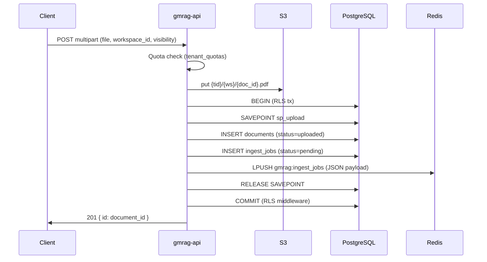
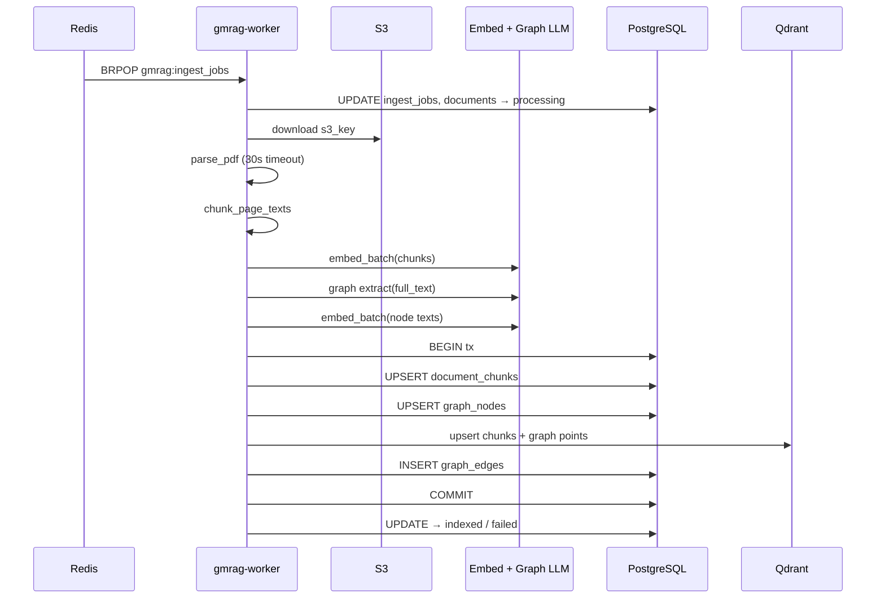
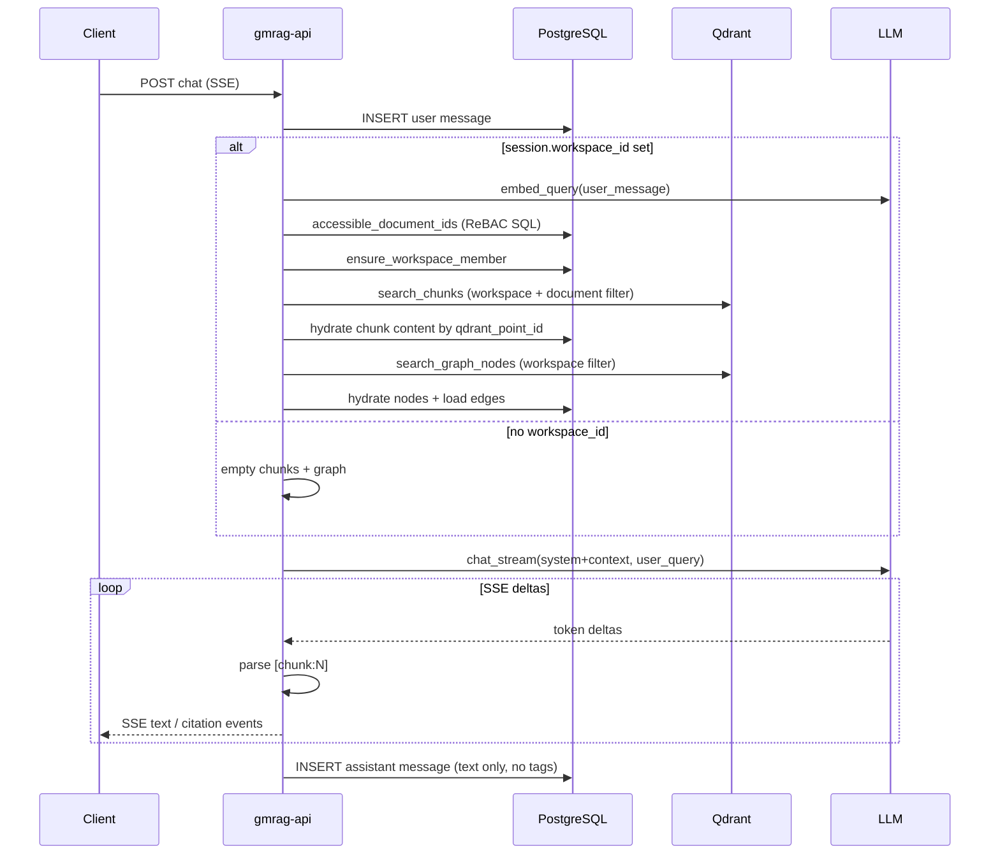
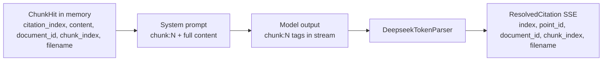

# RAG Dataflow — GMRAG 2.0

**Audit:** T84D (pre-frontend)  
**Evidence source:** `backend/crates/` only  
**Date:** 2026-06-23

---

## End-to-End Overview

```mermaid
flowchart TB
    subgraph Upload["API — Upload"]
        U1[POST /tenants/{tid}/documents<br/>multipart: file, workspace_id, visibility]
        U2[Quota check — tenant_quotas]
        U3[S3 put — {tid}/{ws}/{doc_id}.pdf]
        U4[INSERT documents status=uploaded]
        U5[INSERT ingest_jobs status=pending]
        U6[Redis LPUSH gmrag:ingest_jobs]
    end

    subgraph Worker["Worker — Ingest"]
        W1[Redis BRPOP gmrag:ingest_jobs timeout=5s]
        W2[status → processing]
        W3[S3 download — full bytes in memory]
        W4[parse_pdf — timeout 30s]
        W5[chunk_page_texts — cl100k 1200/100]
        W6[select_embedder — Ollama or BYOK OpenAI]
        W7[embed_batch chunks — batch=32]
        W8[select_graph_extractor — DeepSeek or BYOK]
        W9[extract full_text → nodes/edges JSON]
        W10[embed_batch node descriptions]
        W11[dual_write_ingestion]
        W12[status → indexed | failed]
    end

    subgraph Storage["Persistence"]
        PG[(PostgreSQL<br/>documents, document_chunks,<br/>graph_nodes, graph_edges, ingest_jobs)]
        QC[(Qdrant chunks_{tenant_id}<br/>768-dim cosine)]
        QG[(Qdrant graph_{tenant_id}<br/>768-dim cosine)]
        S3[(S3 / MinIO)]
    end

    subgraph Chat["API — Chat RAG"]
        C1[POST .../chat_sessions/{sid}/chat SSE]
        C2[INSERT user message]
        C3[embed_query — single vector]
        C4[retrieve_chunks_with_vector — ACL filter]
        C5[retrieve_graph_context — workspace filter]
        C6[assemble_system_prompt — chunk:N tags]
        C7[stream_rag_response — LLM SSE]
        C8[DeepseekTokenParser — parse chunk:N]
        C9[enrich_stream_events — citation SSE]
        C10[persist assistant message]
    end

    U1 --> U2 --> U3 --> U4 --> U5 --> U6
    U6 --> W1 --> W2 --> W3 --> W4 --> W5 --> W6 --> W7 --> W8 --> W9 --> W10 --> W11 --> W12
    U3 --> S3
    W3 --> S3
    W11 --> PG
    W11 --> QC
    W11 --> QG
    C1 --> C2 --> C3 --> C4 --> C5 --> C6 --> C7 --> C8 --> C9 --> C10
    C3 --> QC
    C3 --> QG
    C4 --> QC
    C4 --> PG
    C5 --> QG
    C5 --> PG
    C10 --> PG
```

---

## Phase 1 — Component Map

| Stage | Entry point | Key file | Output |
|-------|-------------|----------|--------|
| Upload | `upload_document` | `api/src/routes/documents.rs` | S3 object + `documents` row + `ingest_jobs` row + Redis payload |
| Job queue | `RedisEnqueuer::enqueue` | `api/src/queue.rs` | JSON on `gmrag:ingest_jobs` |
| Worker poll | `poll_once` / `run` | `worker/src/lib.rs`, `worker/src/queue.rs` | `IngestJob` struct |
| Retry wrapper | `process_job_with_retry` | `worker/src/job.rs` | Max 3 attempts, exponential backoff 1s→16s |
| PDF parse | `parse_pdf` | `worker/src/pdf_parser.rs` | `ParsedDocument { text, page_count }` |
| Chunk | `chunk_page_texts` | `worker/src/chunking.rs` | `Vec<String>` token-bounded chunks |
| Embed | `select_embedder` + `embed_batch` | `worker/src/embedding.rs` | 768-dim vectors |
| Graph extract | `DeepSeekGraphExtractor::extract` | `worker/src/graph.rs` | `GraphExtraction { nodes, edges }` |
| Dual write | `dual_write_ingestion` | `worker/src/qdrant_writer.rs` | Postgres upserts + Qdrant upserts (Qdrant before commit) |
| Qdrant setup | `setup_tenant_collections` | `core/src/qdrant/store.rs` | `chunks_{tid}`, `graph_{tid}` |
| Retrieval | `retrieve_all_with_metering` | `api/src/chat/retrieval.rs` | `Vec<ChunkHit>` + `GraphContext` |
| Prompt | `assemble_system_prompt` | `api/src/chat/mod.rs` | System string with `[chunk:N]` excerpts |
| Stream | `stream_rag_response` | `api/src/chat/streaming.rs` | Parsed text + citation events |
| Citations | `enrich_stream_events` | `api/src/chat/mod.rs` | SSE JSON with `ResolvedCitation` |

---

## Upload Sequence



**Race (code-evidenced):** Redis `LPUSH` occurs inside the request transaction before `rls_middleware` commits (`documents.rs` enqueue then handler return → `rls.rs` COMMIT). A worker may `BRPOP` and query Postgres before the document row is visible to other connections.

---

## Ingest Sequence



**Production parse path:** `process_job` passes `vec![parsed.text]` (single combined string) to chunking — not per-page arrays (`worker/src/job.rs`).

**OCR path:** `parse_pdf_with_ocr` exists but is **not** called from `process_job` (comment references T37 / PdfiumRenderer blocker).

---

## Chat / Retrieval Sequence



**Chat history:** Prior messages are stored in `chat_messages` but **not** loaded into the LLM prompt. Only the current `user_message` is sent (`chat.rs` → `stream_rag_response` with single user message).

---

## Qdrant Collection Layout

```mermaid
flowchart LR
    subgraph TenantA["Tenant A"]
        CA[chunks_{tenant_a}]
        GA[graph_{tenant_a}]
    end
    subgraph TenantB["Tenant B"]
        CB[chunks_{tenant_b}]
        GB[graph_{tenant_b}]
    end

    CA -->|payload filter| W1[workspace_id]
    CA -->|payload filter| D1[document_id]
    GA -->|payload filter| W2[workspace_id]
```

- **Hard isolation:** collection name includes `tenant_id` (`core/src/qdrant/store.rs`).
- **Soft partition:** `workspace_id` payload index + search filter.
- **Chunk ACL at search:** `must workspace_id` + `should document_id IN accessible` with `min_should: 1` (`retrieval.rs` `build_chunk_filter`).
- **Graph at search:** `must workspace_id` only — no document-level filter.

---

## Citation Data Path



Fields **not** present in citation SSE: `page`, `snippet`, `score`, chunk `content`.

---

## Delete / Cleanup Paths

| Action | S3 | Qdrant chunks | Qdrant graph | Postgres graph |
|--------|----|--------------|--------------|----------------|
| DELETE document | best-effort delete | best-effort `delete_chunks_by_document` | **not touched** | cascade via FK |
| DELETE tenant | **not touched** | **not touched** | **not touched** | cascade DELETE |
| `teardown_tenant_collections` | — | delete collection | delete collection | — |

`teardown_tenant_collections` exists in `core/src/qdrant/store.rs` but is **not** called from `delete_tenant` (`routes/tenants.rs`).

---

## Key Constants (code)

| Constant | Value | Location |
|----------|-------|----------|
| `CHUNK_SIZE_TOKENS` | 1200 | `worker/src/chunking.rs` |
| `CHUNK_OVERLAP_TOKENS` | 100 | `worker/src/chunking.rs` |
| `EMBED_DIM` | 768 | `core/src/qdrant/store.rs`, `worker/src/embedding.rs` |
| `DEFAULT_BATCH_SIZE` | 32 | `worker/src/embedding.rs` |
| `MAX_ATTEMPTS` (ingest) | 3 | `worker/src/job.rs` |
| `PDF_PARSE_TIMEOUT_SECS` | 30 | `worker/src/job.rs` |
| `DEFAULT_TOP_K` (retrieval) | 5 | `api/src/chat/retrieval.rs` |
| `GRAPH_SCORE_THRESHOLD` | 0.25 | `api/src/chat/retrieval.rs` |
| Upload body limit | 50 MiB | `api/src/lib.rs` |
| Redis queue key | `gmrag:ingest_jobs` | `api/src/queue.rs` |
| `POLL_TIMEOUT_SECS` | 5 | `worker/src/queue.rs` |
