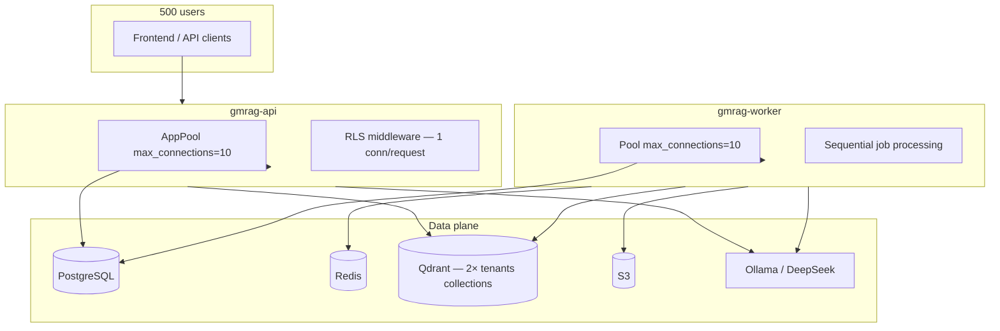

# RAG Scalability Audit — GMRAG 2.0 (T84D)

**Audit date:** 2026-06-23  
**Target scale:** 10,000 documents · 500 active users · multi-tenant SaaS · GraphRAG · ReBAC  
**Method:** Code analysis + qualitative modeling; **no load tests in repository**

---

## Target Scale Assumptions

These assumptions are used for modeling only where the code does not specify behavior:

| Parameter | Assumption | Code anchor |
|-----------|------------|-------------|
| Documents | 10,000 total across platform | User target |
| Active users | 500 concurrent-ish | User target |
| Tenants | **UNKNOWN** — could be 10–500 | Not specified |
| Chunks per document | ~15–25 for text PDFs (1200-token windows) | `chunking.rs` |
| Graph nodes per workspace | ~100–10,000+ over time | No cap in code |
| Workers | 1 replica default | `worker/src/lib.rs` sequential loop |

**Default quota conflict:** `tenant_quotas.max_documents` defaults to **100** (`migrations/20260617145246_system_tracking.sql`). Reaching 10k docs requires quota overrides per tenant — not a hard architecture limit but an operational gate.

---

## System Topology at Scale



---

## PostgreSQL

### Connection pools

```rust
// core/src/db.rs
.max_connections(10)  // init_pool and init_app_pool
```

| Deployment | Connections | Risk at 500 users |
|--------------|-------------|-------------------|
| 1 API replica | 10 app + admin pool | **HIGH** — RLS holds connection for full request; SSE chat holds through Phase A then releases |
| 1 worker | 10 | Moderate — one job at a time |
| N API replicas | 10×N | Must stay within Postgres `max_connections` |

**Bottleneck:** Pool exhaustion under concurrent chat + upload. Acquire timeout 5s → 503-style failures.

### Indexes (present)

| Table | Indexes |
|-------|---------|
| `documents` | tenant, workspace |
| `document_chunks` | tenant, document_id |
| `graph_nodes` | tenant, kind, workspace |
| `graph_edges` | tenant, src, dst |
| `ingest_jobs` | tenant, status, document_id |
| `resource_acl` | tenant, resource, principal, check composite |

### Missing indexes (evidenced gaps)

| Query | Column | Impact |
|-------|--------|--------|
| Chunk hydration | `document_chunks.qdrant_point_id` | **No index** — lookup by point_id at retrieval |
| Graph ILIKE fallback | `graph_nodes.label`, `properties->>'description'` | **No trigram/GiN** — sequential scan at scale |

### Row volume estimates (10k docs)

| Table | Estimated rows |
|-------|----------------|
| `documents` | 10,000 |
| `document_chunks` | 150,000–250,000 |
| `graph_nodes` | **UNKNOWN** — deduped per label; grows with unique entities |
| `graph_edges` | **UNKNOWN** — 0–1M+ per user target |
| `ingest_jobs` | ≥10,000 (one per upload) |
| `usage_events` | grows unbounded (append-only) |

### RLS overhead

Every query on tenant tables evaluates `tenant_id = gmrag_current_tenant()` — indexed tenant columns mitigate full scans.

---

## Qdrant

### Collection explosion

| Tenants | Collections | Vectors (chunk estimate) |
|---------|-------------|------------------------|
| 50 | 100 | Depends on doc distribution |
| 500 | **1,000** | 200k vectors if 10k docs in one tenant; spread if multi-tenant |

**Strategy:** Hard tenant isolation via collection name — good for security, increases Qdrant metadata overhead vs shared collection.

### Vector counts (single large tenant, 10k docs)

- Chunks: ~200k points @ 768 dims cosine
- Graph: **UNKNOWN** — deduplicated nodes; re-ingest updates same points

### HNSW

Default Qdrant HNSW — no custom `ef_construct` / `m` in code. Tuning for 200k+ points: **UNKNOWN** impact without benchmark.

### Search cost

Per chat message:
- 1× chunk search (top_k=5, filtered)
- 1× graph search (top_k=5, workspace filter)
- 1× embed query

Payload filters use indexed fields — expected O(log n) filter + HNSW search.

### Payload filter at 500 tenants

Each tenant's searches scoped to own collections — **no cross-tenant search cost**.

---

## Graph Subsystem at 100k Nodes / 1M Edges

| Operation | Code behavior | Scale risk |
|-----------|---------------|------------|
| Ingest extract | Full doc text → LLM | Context limit **UNKNOWN** |
| Node upsert | Per-node INSERT | Linear in extracted nodes per doc |
| Edge insert | Per-edge INSERT | Linear |
| Chat retrieval | top_k=5 nodes + edge load for those IDs | Bounded per query |
| Graph API | Full SELECT all nodes + edges | **HIGH** — unpaginated |
| ILIKE fallback | `LIMIT top_k` but table scan | **HIGH** at 100k nodes |

**Orphan accumulation:** Document deletes do not prune graph — node/edge counts monotonically increase toward user target unless manual cleanup added.

---

## Ingest Throughput

### Single worker sequential pipeline

Per document (order of magnitude, not measured):
1. S3 download — network + size bound (50 MiB upload cap)
2. PDF parse — up to 30s timeout
3. Chunk — CPU tiktoken
4. Embed chunks — ceil(n/32) batches × Ollama RTT
5. Graph LLM — 60s timeout, full text
6. Embed nodes — batch
7. Dual write — Postgres tx + Qdrant upsert `.wait(true)`

**Throughput bound:** ~1 doc at a time per worker replica. 10k docs: **hours to days** depending on doc size and LLM latency — **UNKNOWN** exact duration without measurement.

### Embed bottlenecks

- Batch size 32, concurrency 2
- Single embedder instance per job (no parallel chunk/graph embed overlap)
- Platform Ollama: shared resource across tenants

---

## Retrieval Bottlenecks

### Per chat request

| Step | DB/Qdrant ops |
|------|---------------|
| embed_query | 1 HTTP to Ollama/OpenAI |
| accessible_document_ids | 1 SQL |
| ensure_workspace_member | 1 SQL |
| search_chunks | 1 Qdrant |
| hydrate chunks | **Up to 5** SQL queries (loop per hit) |
| search_graph | 1 Qdrant |
| hydrate graph nodes | up to 5 SQL |
| load_graph_edges | 1 SQL with ANY array |

**N+1 hydration:** Could batch by `qdrant_point_id IN (...)` — not implemented.

### Context assembly

5 × ~1200 tokens ≈ 6000 tokens in system prompt + graph section — within typical model windows but LLM latency grows with input size.

---

## Latency Estimates

**Quantitative P50/P95/P99: NOT AVAILABLE** — repository contains no benchmarks, APM, or load test results.

### Qualitative component ranking (typical chat request)

| Component | Expected dominance | Notes |
|-----------|-------------------|-------|
| LLM streaming | **Highest** | DeepSeek/Ollama network + generation |
| Query embedding | Medium | Single batch-1 embed |
| Qdrant search (×2) | Low–Medium | 200k HNSW usually <100ms (industry typical, **unverified here**) |
| Postgres ACL + hydrate | Low–Medium | 7–12 queries; pool wait dominates under load |
| Retrieval total (ex-LLM) | Medium | ~100–500ms in healthy LAN deployment — **speculative** |

### Under load (500 users)

| Metric | Qualitative |
|--------|-------------|
| P50 | Dominated by LLM if chat-heavy |
| P95 | Pool acquire wait + Ollama queue |
| P99 | Timeouts (PDF 30s, graph 60s on ingest; not chat) |

---

## Multi-Tenant SaaS Considerations

| Concern | Status |
|---------|--------|
| Noisy neighbor (Ollama) | Platform embedder shared — **no per-tenant fair queue** |
| Quota enforcement | Storage bytes + doc count on upload |
| Rate limiting | **Not implemented** (grep: no rate_limit) |
| Usage metering | Append-only `usage_events` — no aggregation performance validated |
| Collection per tenant | 500 tenants → 1000 collections — monitor Qdrant memory |

---

## Scalability Readiness Verdict

| Gate | Verdict |
|------|---------|
| **SCALABILITY READY** | **CONDITIONAL** |

### Blockers for target scale

1. **Pool size 10** — insufficient for 500 active users without horizontal API scaling and pool tuning
2. **Single sequential worker** — ingest backlog for 10k docs
3. **Default doc quota 100** — must raise for large tenants
4. **Graph API unpaginated** — breaks at 100k nodes
5. **No rate limiting** — abuse risk

### Acceptable with scaling actions

- Tenant-per-collection Qdrant model (with Qdrant cluster sizing)
- HNSW default for ~200k vectors per tenant
- RLS + indexed tenant columns

---

## Scaling Recommendations (documentation only)

| Priority | Action |
|----------|--------|
| P0 | Increase pool sizes via env/config; horizontal API + worker replicas |
| P0 | Paginate graph API; add node count limits per workspace |
| P1 | Batch chunk hydration query (`WHERE qdrant_point_id = ANY($1)`) |
| P1 | Index `document_chunks(qdrant_point_id)` |
| P1 | Stuck-job sweeper + multiple worker consumers |
| P2 | Prometheus metrics + retrieval latency histograms |
| P2 | Graph node GC on document delete (or reference counting) |
| P2 | Rate limiting on upload and chat |

---

## Capacity Planning Worksheet (qualitative)

| Resource | 10k docs | 500 users | Action |
|----------|----------|-----------|--------|
| Postgres storage | ~GB scale (chunks text) | Low connection count stress | Pool + read replicas **UNKNOWN need** |
| Qdrant RAM | ~200k × 768 × 4 bytes ≈ 600MB vectors + graph | Per-tenant isolation | Monitor per collection |
| S3 | 10k × avg file size | — | Lifecycle policy **not in code** |
| Redis | Single list key | Low | Job queue not sharded |
| Ollama GPU | Embed + optional OCR | Chat embed burst | **UNKNOWN** — external to repo |
