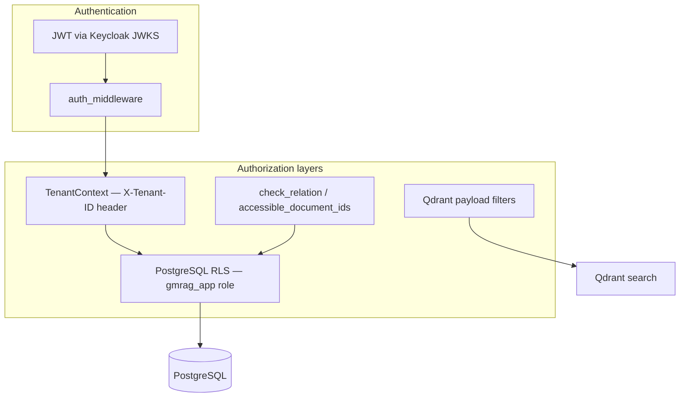
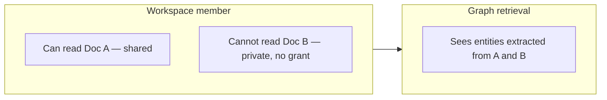

# RAG Security Audit — GMRAG 2.0 (T84D)

**Audit date:** 2026-06-23  
**Method:** Code-only; adversarial review  
**Scope:** ReBAC, tenant isolation, retrieval enforcement, data lifecycle  
**Target:** Multi-tenant SaaS · 500 users · GraphRAG enabled

---

## Security Architecture

### Layers (evidenced)

| Layer | Mechanism | File |
|-------|-----------|------|
| Authentication | Bearer JWT validated against OIDC JWKS | `api/src/auth/jwt.rs`, `middleware.rs` |
| Tenant binding | `X-Tenant-ID` header → `TenantContext`; path must match | `routes/tenants.rs` `ensure_path_matches_context` |
| Row isolation | RLS `tenant_id = gmrag_current_tenant()` on 14+ tables | `migrations/20260617145935_rls_apply_all.sql` |
| Object permissions | ReBAC check engine, max depth 16 | `api/src/rbac/check.rs` |
| Vector search | Tenant collection name + payload filters | `core/src/qdrant/store.rs`, `retrieval.rs` |

---

## ReBAC Model

**Definition:** `api/src/rbac/model.rs`

| Namespace | Relations | Inheritance |
|-----------|-----------|-------------|
| `document` | owner, editor, viewer | viewer ⊇ editor ⊇ owner; viewer includes workspace member |
| `chat_session` | owner, editor, viewer | same pattern |
| `workspace` | owner, editor, viewer, member | member derived from `workspace_members` |

**Storage:** `resource_acl` — `(resource_type, resource_id, principal_type, principal_id, permission)`  
**Constraints:** permission ∈ `{owner, editor, viewer}`; principal ∈ `{user, workspace}` (`migrations/20260622000000_rebac_relation_tuples.sql`)

**Grant API:** `api/src/routes/acl.rs`
- Create: owner-only; shareable types: `document`, `chat_session`; relations: `editor`, `viewer` only
- Revoke: owner-only; writes audit log
- List: viewer on resource

---

## Retrieval Enforcement

### Chunks (strong)

Three layers in `retrieve_chunks_with_vector`:

1. **`ensure_workspace_member`** — caller must be in `workspace_members`
2. **`accessible_document_ids`** — SQL compilation of viewer ReBAC (shared, owner, workspace member, ACL grant)
3. **Qdrant filter** — `must workspace_id` + `should document_id ∈ accessible`
4. **Post-filter** — skip hits where `document_id ∉ allowed`

Test evidence: `retrieve_chunks_scoped_to_workspace`, `accessible_docs_grant_sees_private_doc` (`retrieval.rs` tests)

### Graph (weak)

`retrieve_graph_context`:
- Filters: `workspace_id` only (Qdrant + SQL)
- **No** `accessible_document_ids`
- **No** `ensure_workspace_member` (called from `retrieve_all_with_metering` after chunk path — chunk path fails first for non-members)

**Impact:** Any workspace member receives graph context derived from **all documents** ingested into that workspace, including private documents they cannot read via chunks.

This is an **information leak** at the entity/relationship level, not chunk text.

### Graph REST API

`GET .../workspaces/{wid}/graph`:
- Gate: `check_relation(workspace, Member)` — workspace membership only
- Returns full node/edge set for workspace

Same leak class as chat graph retrieval.

---

## Identified Vulnerabilities & Inconsistencies

### SEC-1 — Graph context bypasses document ACL (P0)

| Attribute | Value |
|-----------|-------|
| Type | Data leak |
| Evidence | `retrieve_graph_context` — no document filter; `graph.rs` API — workspace member only |
| Attack | Workspace member queries chat on workspace containing others' private docs; graph section may reveal entity names/relationships from those docs |
| Mitigation in code | **None** |

### SEC-2 — Grant-only user: preview yes, chat no (P1)

| Attribute | Value |
|-----------|-------|
| Type | Inconsistent authorization |
| Evidence | Test `accessible_docs_grant_sees_private_doc` — grant works for SQL set; `ensure_workspace_member` returns `NotWorkspaceMember` for non-members |
| Impact | External collaborator with document grant can preview but not chat — may be intentional but contradicts share UX expectations |
| Mitigation | **None** — product decision required |

### SEC-3 — Qdrant orphan vectors after failed delete (P1)

| Attribute | Value |
|-----------|-------|
| Type | Stale data exposure |
| Evidence | `delete_document` — Qdrant cleanup warn-only; Postgres row deleted regardless |
| Attack | Orphan vectors retain old chunk embeddings/payload; if IDs reused (they are not — doc deleted), low risk; stale vectors remain searchable if filter bug |
| Mitigation | Post-filter on `document_id` limits exposure to accessible docs; orphaned points for deleted docs should not match accessible set |

**Residual risk:** LOW for ACL bypass (document_id no longer in accessible set), MEDIUM for storage hygiene / cross-tenant confusion if filters fail.

### SEC-4 — Tenant delete without Qdrant/S3 teardown (P0)

| Attribute | Value |
|-----------|-------|
| Type | Data retention / compliance |
| Evidence | `delete_tenant` — `DELETE FROM tenants` only (`routes/tenants.rs`); `teardown_tenant_collections` not called |
| Impact | Vector data and S3 objects survive tenant deletion |
| Mitigation | **None** in API |

### SEC-5 — Redis enqueue before DB commit (P1)

| Attribute | Value |
|-----------|-------|
| Type | Race / integrity |
| Evidence | Upload enqueues inside RLS tx before middleware COMMIT |
| Impact | Worker may fail to find document; retry may eventually succeed or mark failed |
| Direct security impact | **UNKNOWN** — failure mode, not proven ACL bypass |

### SEC-6 — Shared document visibility (by design)

| Attribute | Value |
|-----------|-------|
| Type | Intended behavior |
| Evidence | `visibility = 'shared'` grants viewer to all tenant users (`check.rs`, `accessible_document_ids`) |
| Note | Any tenant member can retrieve shared doc chunks in workspace |

### SEC-7 — 404-on-deny (anti-enumeration)

| Attribute | Value |
|-----------|-------|
| Type | Hardening |
| Evidence | Preview/delete/chat session return 404 when viewer check fails |
| Assessment | Positive — reduces resource enumeration |

### SEC-8 — Privilege escalation on ACL (tested negative)

| Attribute | Value |
|-----------|-------|
| Evidence | `rebac_e2e.rs` — viewer cannot create grants; cross-tenant grant invisible |
| Assessment | **No escalation found** in tested paths |

### SEC-9 — RLS isolation (tested)

| Attribute | Value |
|-----------|-------|
| Evidence | `api/tests/rls_isolation.rs`, cross-tenant tests in `rebac_e2e.rs` |
| Assessment | Tenant boundary enforced at Postgres layer |

### SEC-10 — BYOK key handling

| Attribute | Value |
|-----------|-------|
| Evidence | AES-GCM encrypt on write when `GMRAG_TENANT_KEY_ENCRYPTION_KEY` set (`routes/settings.rs`, `core/src/crypto.rs`) |
| Gap | Encryption key optional — plaintext path if env unset: **UNKNOWN** without reading full settings insert path |

---

## ACL Revoke Latency

- Revoke: `DELETE FROM resource_acl` — immediate
- Next retrieval: `accessible_document_ids` recompiled — **no cache** in code
- Qdrant payloads unchanged until re-ingest — post-filter uses live Postgres ACL, not Qdrant `visibility` alone

**Revoke effective for chunk retrieval:** Immediate (SQL-based).

**Revoke effective for graph:** **Not applicable** — graph not ACL-filtered per document.

---

## Workspace Inheritance

Document viewer includes workspace member (`model.rs` TupleToUserset). Confirmed in E2E test `e2e_workspace_inheritance_grants_preview`.

Workspace-group grants (`principal_type = workspace`) propagate to members per `rbac/check.rs` grant_tuple logic — tested in `acl_routes.rs`.

---

## Share Behavior Summary

| Action | Who | Result |
|--------|-----|--------|
| Share document (editor/viewer grant) | Owner | Insert `resource_acl` + audit |
| Revoke grant | Owner | Delete + audit |
| Shared visibility | Owner at upload | All tenant users get viewer |
| Chat on shared doc | Workspace member | Works |
| Chat on granted doc (non-member) | Grant recipient | **Fails** — not workspace member |
| Graph after share | Workspace member | Sees all workspace graph |

---

## Threat Model — Attempted Breaks

| Attack | Result |
|--------|--------|
| Cross-tenant document access via API | **Blocked** — RLS + tenant header |
| Cross-tenant Qdrant search | **Blocked** — separate collections per tenant |
| Cross-workspace chunk retrieval | **Blocked** — workspace_id must filter + SQL scope |
| Read private doc via chunk search without grant | **Blocked** — accessible_document_ids + post-filter |
| Read private doc entities via graph | **NOT BLOCKED** — workspace member sees graph from all docs |
| Re-share as viewer | **Blocked** — E2E test |
| Grant on other tenant's resource | **Blocked** — RLS |
| Access after ACL revoke (chunks) | **Blocked** — immediate SQL effect |
| Ingest duplicate to exfiltrate | **No upload dedup** — creates separate copy; same ACL applies |
| JWT without tenant header on tenant routes | **Blocked** — tenant middleware |

---

## Security Readiness Verdict

| Gate | Verdict |
|------|---------|
| **SECURITY READY** | **CONDITIONAL** |

**Blockers before production:**
1. Graph retrieval/API must enforce document-level ACL or strip graph from chat for unauthorized docs
2. Tenant delete must teardown Qdrant + S3
3. Resolve grant-only vs workspace-member policy for chat

**Acceptable with documented constraints:**
- 404-on-deny pattern
- Shared visibility semantics within tenant
- RLS + chunk triple-filter

---

## Recommendations (documentation only — no code changes in T84D)

1. Add document-provenance to graph nodes (source `document_id` set) and filter retrieval by accessible documents
2. Wire `teardown_tenant_collections` + S3 prefix delete into `delete_tenant`
3. Either relax `ensure_workspace_member` when user holds document grant, or reject document grants for non-members at ACL create time
4. Add security regression test: private doc graph entities not returned to unauthorized member
