# Tổng Quan Kiến Trúc Hệ Thống GMRAG 2.0

> **Dành cho:** Dev mới onboard dự án GMRAG 2.0  
> **Cập nhật lần cuối:** 2026-06-24  
> **Phiên bản:** 2.0 (T84D Phase 1–3.1)

---

## Mục Lục

1. [Giới thiệu & Mục đích](#1-giới-thiệu--mục-đích)
2. [Kiến trúc tổng thể](#2-kiến-trúc-tổng-thể)
3. [Mô hình Multi-Tenant](#3-mô-hình-multi-tenant)
4. [Hệ thống phân quyền ReBAC](#4-hệ-thống-phân-quyền-rebac)
5. [Luồng Ingest tài liệu](#5-luồng-ingest-tài-liệu)
6. [Luồng Chat RAG](#6-luồng-chat-rag)
7. [Qdrant Collection Layout](#7-qdrant-collection-layout)
8. [Page Metadata & Citation](#8-page-metadata--citation)
9. [Database Schema tổng quan](#9-database-schema-tổng-quan)
10. [Tech Stack & Dependencies](#10-tech-stack--dependencies)
11. [Các hằng số hệ thống](#11-các-hằng-số-hệ-thống)

---

## 1. Giới thiệu & Mục đích

GMRAG 2.0 là hệ thống **GraphRAG** (Graph-enhanced Retrieval-Augmented Generation) đa thuê bao (multi-tenant), kết hợp hai kỹ thuật chính:

- **RAG truyền thống**: Tìm kiếm ngữ nghĩa trên các đoạn văn bản (chunks) đã được nhúng vector để cung cấp ngữ cảnh cho LLM.
- **Graph RAG**: Khai thác thêm đồ thị tri thức (knowledge graph) gồm các thực thể và mối quan hệ được trích xuất từ tài liệu, giúp LLM trả lời các câu hỏi đòi hỏi suy luận liên kết.

Tài liệu này mô tả toàn bộ kiến trúc kỹ thuật, các luồng xử lý chính, cơ chế phân quyền và cấu trúc dữ liệu — giúp dev mới nắm bắt hệ thống nhanh chóng, tránh vi phạm các quy tắc an toàn dữ liệu của từng tenant.

---

## 2. Kiến trúc Tổng Thể

### Sơ đồ thành phần hệ thống

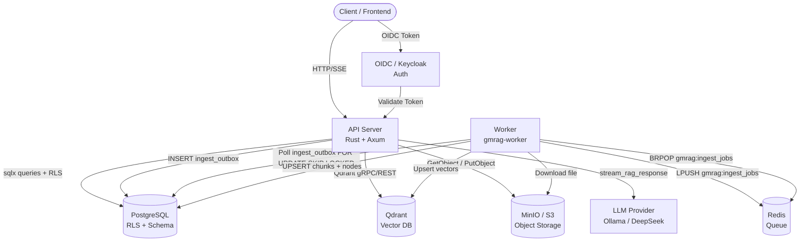

### Các thành phần chính

| Thành phần | Công nghệ | Vai trò |
|---|---|---|
| **API Server** | Rust + Axum + Tokio | Xử lý HTTP request, quản lý tenant, RAG pipeline |
| **Worker** | Rust binary (gmrag-worker) | Xử lý ingest tài liệu bất đồng bộ |
| **PostgreSQL** | PostgreSQL + RLS + sqlx | Lưu metadata, bật Row-Level Security cô lập tenant |
| **Qdrant** | Qdrant (cosine 768-dim) | Vector search cho chunks và graph nodes |
| **Redis** | Redis LPUSH/BRPOP | Hàng đợi ingest job giữa relay và worker |
| **MinIO / S3** | AWS S3-compatible | Lưu file tài liệu gốc (PDF, ...) |
| **LLM Provider** | Ollama (local) / DeepSeek (remote BYOK) | Sinh câu trả lời từ context |
| **OIDC / Keycloak** | OpenID Connect | Xác thực người dùng |

---

## 3. Mô hình Multi-Tenant

### Nguyên tắc cô lập tenant

Mỗi tenant được cô lập hoàn toàn ở cả ba lớp lưu trữ:

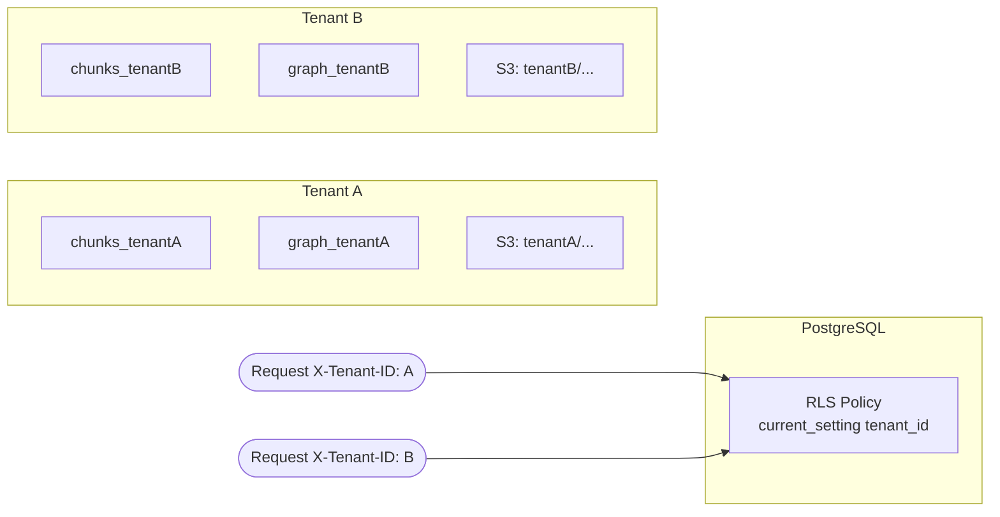

### Cơ chế cô lập

**1. Qdrant — Collections riêng biệt:**
- Mỗi tenant có 2 collection độc lập:
  - `chunks_{tenant_id}` — lưu vector của các đoạn văn bản
  - `graph_{tenant_id}` — lưu vector của các node đồ thị tri thức
- Không có collection dùng chung giữa các tenant.

**2. PostgreSQL — Row-Level Security (RLS):**
- Mọi bảng dữ liệu tenant đều bật RLS.
- Middleware sau khi xác thực `X-Tenant-ID` header sẽ SET RLS context:
  ```sql
  SET LOCAL app.current_tenant_id = '<tenant_id>';
  ```
- RLS policy tự động lọc dữ liệu theo `tenant_id` trên mọi truy vấn trong transaction đó.

**3. S3 — Prefix theo tenant:**
- Key lưu file theo cấu trúc: `{tenant_id}/{workspace_id}/{document_id}.pdf`
- Xóa tenant sẽ xóa toàn bộ prefix `{tenant_id}/`.

### Luồng middleware xử lý request

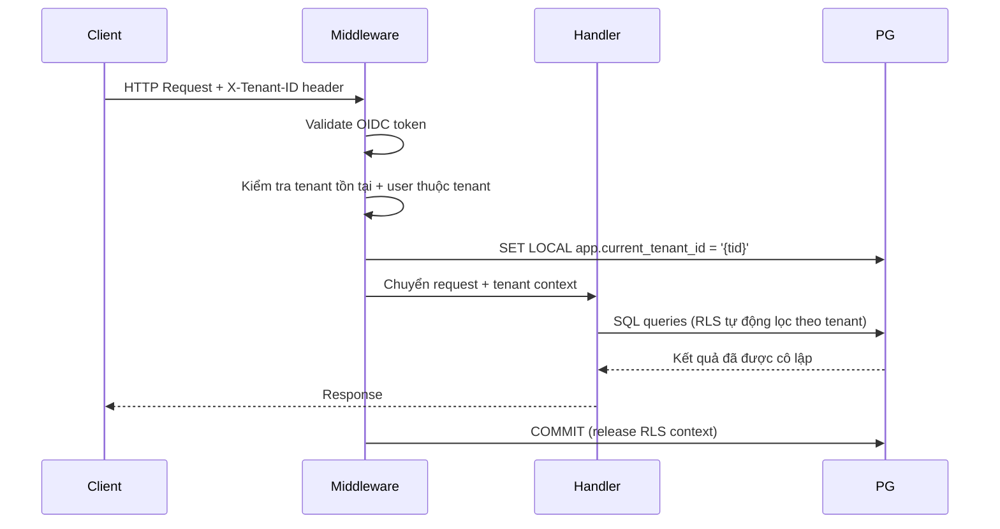

---

## 4. Hệ thống Phân quyền ReBAC

### Mô hình Zanzibar

Hệ thống dùng phân quyền dựa trên quan hệ (Relationship-Based Access Control) theo mô hình Google Zanzibar, được lưu trong bảng `relation_tuples`.

**Cấu trúc một tuple:** `namespace:object_id#relation@principal`

**Ví dụ:**
```
document:doc-123#owner@user:alice
workspace:ws-456#member@user:bob
tenant:t-789#admin@user:carol
```

### Các Namespace và Relation

| Namespace | Relations hợp lệ |
|---|---|
| `tenant` | `owner`, `member` |
| `workspace` | `owner`, `member`, `editor`, `viewer` |
| `document` | `owner`, `editor`, `viewer` |
| `chat_session` | `owner`, `viewer` |

### Quyền truy cập Document

Một user có quyền xem document nếu thoả **ít nhất một** trong ba điều kiện:

1. Document có `visibility = 'shared'` (công khai trong workspace).
2. User là `owner` của document (có tuple `document:{id}#owner@user:{uid}`).
3. User có explicit grant (có tuple `document:{id}#viewer@user:{uid}` hoặc `#editor`).

### Quyền truy cập Graph Node

Graph node không có ACL trực tiếp. Quyền xem node được tính **gián tiếp** qua bảng `graph_node_documents` (provenance):

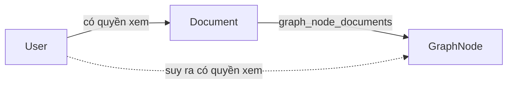

- Hàm `node_visible_via_provenance(node_id, accessible_doc_ids)` kiểm tra: node này có liên kết với ít nhất một document mà user có quyền truy cập không?
- **Secure default**: Node không có provenance row nào = **vô hình** (áp dụng cho dữ liệu cũ trước migration T84D Phase 2).

### Nguyên tắc bảo mật quan trọng

> **404 thay vì 403:** Mọi ReBAC check thất bại đều trả `404 Not Found` thay vì `403 Forbidden` để tránh rò rỉ thông tin về sự tồn tại của resource.

---

## 5. Luồng Ingest Tài Liệu

### Vấn đề Race Condition (trước T84D)

Cách cũ có nguy cơ mất job do race condition:

```
Upload → S3 → INSERT documents → INSERT ingest_jobs → LPUSH Redis
                                                              ↑
                              UNSAFE: Worker có thể BRPOP trước khi Postgres COMMIT
```

### Giải pháp Outbox Pattern (T84D Phase 1)

Thay LPUSH trực tiếp vào Redis bằng ghi vào bảng `ingest_outbox` **trong cùng transaction** với INSERT documents. Một relay process độc lập sẽ đọc outbox và push vào Redis sau khi Postgres đã COMMIT.

### Luồng API Ingest (POST /tenants/{tid}/documents)

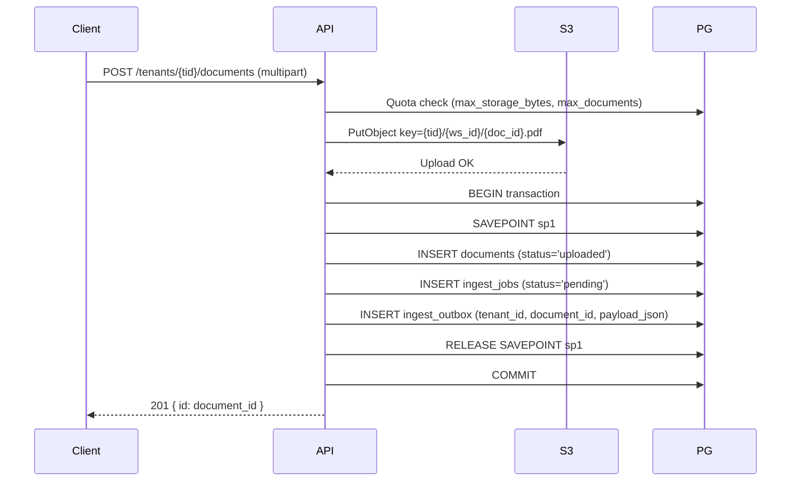

**Lưu ý quan trọng:** `ingest_outbox` thay thế hoàn toàn việc LPUSH Redis từ handler. Đây là điểm mấu chốt của Outbox Pattern — đảm bảo atomicity giữa lưu metadata và enqueue job.

### Worker Relay (`worker/src/relay.rs`)

Relay là một task chạy nền, liên tục poll `ingest_outbox` để chuyển tiếp job vào Redis:

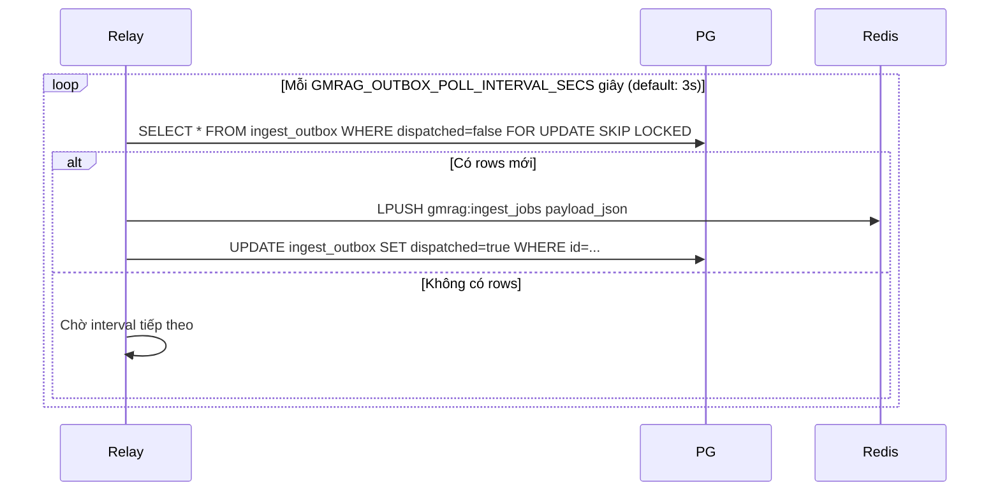

- `FOR UPDATE SKIP LOCKED` đảm bảo nhiều relay instance không xử lý cùng một row (safe for horizontal scaling).
- Biến môi trường: `GMRAG_OUTBOX_POLL_INTERVAL_SECS` (mặc định 3 giây).

### Worker Sweeper (`worker/src/sweeper.rs`)

Sweeper phát hiện và re-enqueue các job bị stuck:

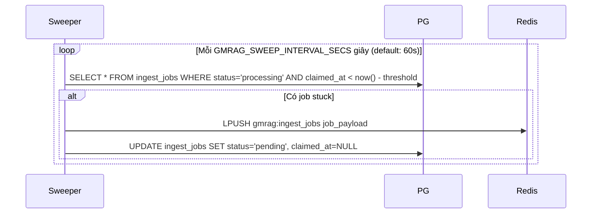

- Biến môi trường: `GMRAG_SWEEP_INTERVAL_SECS` (mặc định 60 giây).

### Worker Main Loop (`worker/src/lib.rs`)

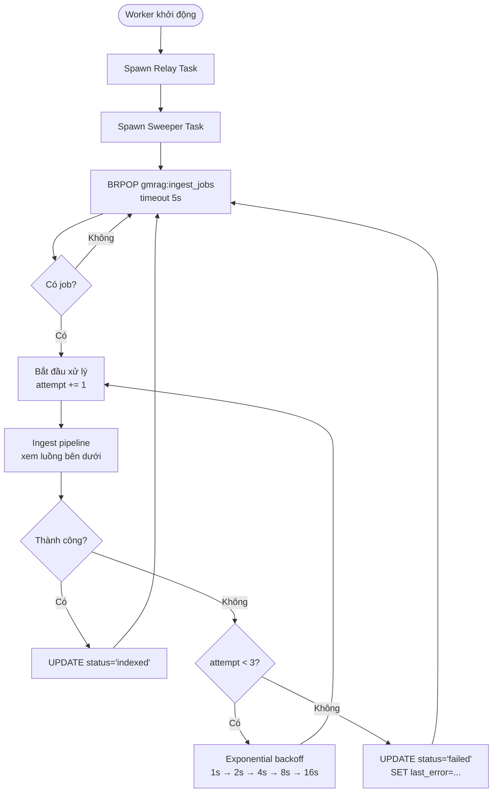

### Luồng xử lý Ingest trong Worker (Pipeline)

Sau khi BRPOP nhận được job, worker thực hiện tuần tự:

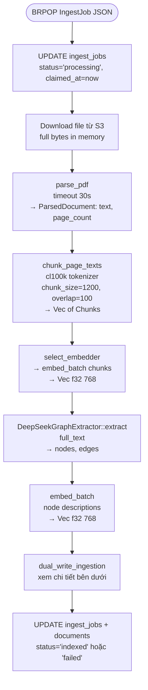

**Chi tiết `dual_write_ingestion()`:**

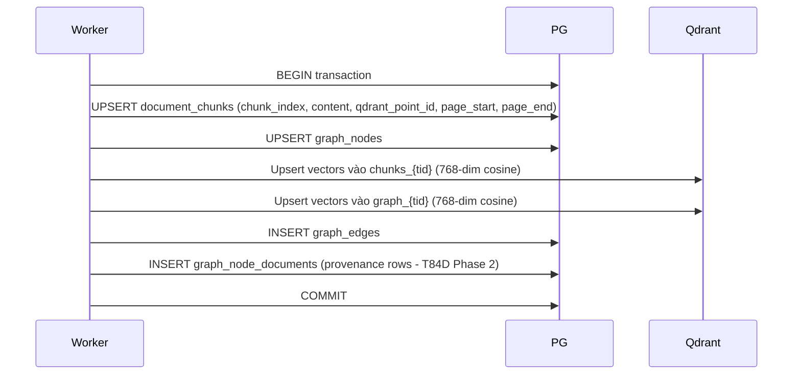

---

## 6. Luồng Chat RAG

### Tổng quan luồng Chat

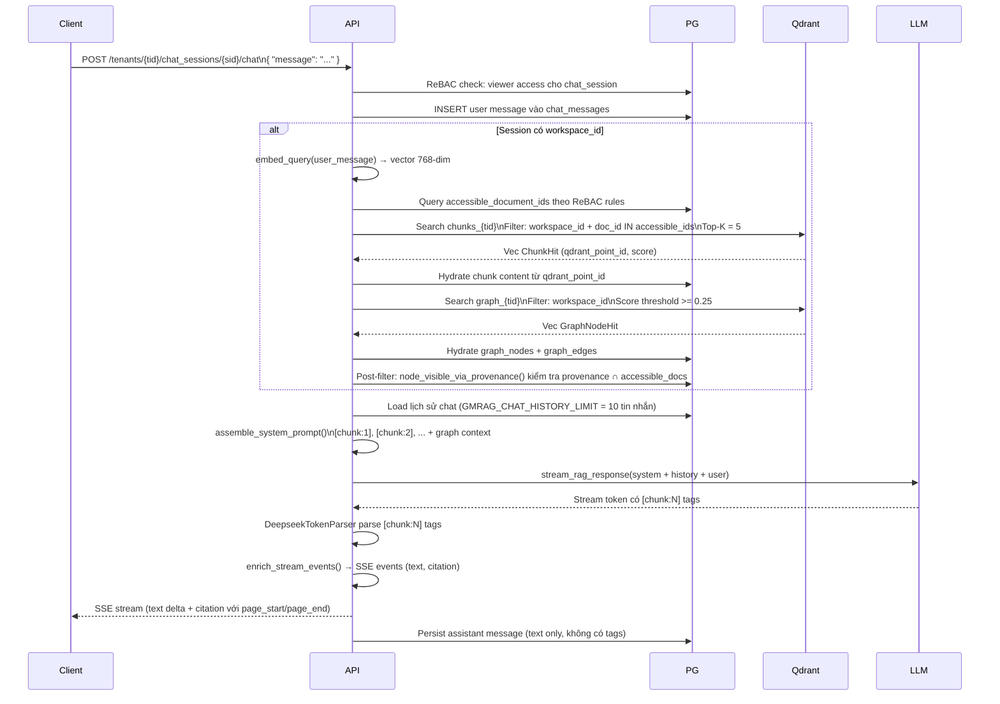

### Chi tiết từng bước

**Bước 1–3: Kiểm tra quyền và lưu message**
- Xác thực user có quyền `viewer` trên `chat_session` qua ReBAC.
- INSERT message của user vào `chat_messages` ngay, trước khi gọi LLM.

**Bước 4a: Embed câu hỏi**
- Gọi embedder để chuyển câu hỏi thành vector 768 chiều, dùng cho semantic search.

**Bước 4b: Truy vấn accessible documents**
- Query Postgres để lấy danh sách `document_id` mà user hiện tại có quyền xem (kết hợp visibility + ownership + explicit grant).
- Danh sách này được dùng làm ACL filter cho Qdrant.

**Bước 4c–4d: Chunk Search**
- Tìm kiếm ngữ nghĩa trong collection `chunks_{tid}`.
- Filter kép: `workspace_id` (must) và `document_id IN accessible_ids` (should) để đảm bảo chỉ trả về chunk từ document user có quyền xem.
- Lấy Top-K = 5 kết quả. Hydrate nội dung thực từ Postgres qua `qdrant_point_id`.

**Bước 4e–4g: Graph Search + Post-filter**
- Tìm kiếm node đồ thị trong collection `graph_{tid}` với score threshold >= 0.25.
- **Bắt buộc** post-filter qua `node_visible_via_provenance()` — không thể filter trực tiếp trong Qdrant vì ACL của node phụ thuộc Postgres.

**Bước 5–7: Tổng hợp context và gọi LLM**
- Load tối đa 10 tin nhắn cũ từ session.
- `assemble_system_prompt()` đóng gói chunks với tag `[chunk:1]`, `[chunk:2]`, ... và thông tin graph nodes/edges.
- Gửi stream request tới LLM: `[system_prompt, ...history, user_message]`.

**Bước 8–10: Parse và stream về client**
- `DeepseekTokenParser` nhận diện `[chunk:N]` trong stream token.
- `enrich_stream_events()` chuyển thành các SSE event có cấu trúc:
  - `text` event: delta text để hiển thị câu trả lời.
  - `citation` event: thông tin chunk được trích dẫn, kèm `page_start`/`page_end`.
- Message của assistant được lưu vào DB dưới dạng text thuần (bỏ tags).

---

## 7. Qdrant Collection Layout

### Collection `chunks_{tenant_id}`

| Thuộc tính | Giá trị |
|---|---|
| Vector dimension | 768 |
| Distance metric | Cosine |
| Mục đích | Semantic search trên đoạn văn bản (chunks) |

**Payload fields:**

| Field | Kiểu | Mô tả |
|---|---|---|
| `workspace_id` | string | ID workspace chứa document |
| `document_id` | string | ID document gốc |
| `chunk_index` | integer | Thứ tự chunk trong document |
| `content` | string | Nội dung text của chunk |
| `filename` | string | Tên file gốc |
| `page_start` | integer (nullable) | Trang bắt đầu (1-based) |
| `page_end` | integer (nullable) | Trang kết thúc (1-based) |

**Filter strategy:**
```
must: workspace_id = "{ws_id}"
should: document_id IN ["{doc1}", "{doc2}", ...]  ← ACL filter
```

### Collection `graph_{tenant_id}`

| Thuộc tính | Giá trị |
|---|---|
| Vector dimension | 768 |
| Distance metric | Cosine |
| Mục đích | Semantic search trên node đồ thị tri thức |

**Payload fields:**

| Field | Kiểu | Mô tả |
|---|---|---|
| `workspace_id` | string | ID workspace |
| `node_id` | string | ID node trong `graph_nodes` |
| `kind` | string | Loại entity (Person, Organization, Concept, ...) |
| `label` | string | Tên/nhãn của node |

**Filter strategy:**
```
must: workspace_id = "{ws_id}"
(ACL filter bổ sung qua Postgres provenance sau khi search)
```

> **Lưu ý:** Node-level ACL không thể đặt hoàn toàn trong Qdrant filter vì danh sách document mỗi user có quyền truy cập được tính động từ Postgres. Post-filter bằng `node_visible_via_provenance()` là bước bắt buộc.

---

## 8. Page Metadata & Citation

### Bối cảnh (T84D Phase 3.1)

Trước Phase 3.1, citation chỉ có thể trỏ đến document, không biết chính xác trang nào. Sau Phase 3.1, hệ thống theo dõi từng chunk thuộc trang nào trong PDF gốc.

### Luồng ghi Page Metadata

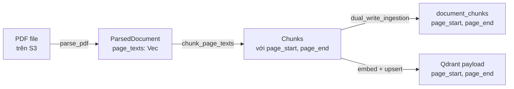

- `page_start` và `page_end` là số trang 1-based, nullable (cho tài liệu không phải PDF hoặc không parse được).
- Cả Postgres lẫn Qdrant payload đều lưu thông tin này để tiện hydrate.

### Luồng đọc & gửi Citation về Client

```mermaid
flowchart LR
    Qdrant_Hit[ChunkHit từ Qdrant\nqdrant_point_id] -->|Hydrate từ PG| ChunkData[Chunk với\npage_start, page_end]
    ChunkData -->|assemble_system_prompt| Prompt[Prompt với\n chunk:N tags]
    Prompt -->|LLM stream| Tags[chunk:N tags\ntrong stream]
    Tags -->|DeepseekTokenParser| Resolved[Resolved citations]
    Resolved -->|enrich_stream_events| SSE[SSE citation event\npage_start, page_end]
    SSE -->|Frontend| PDFViewer[PDF Viewer\nnhảy đến đúng trang]
```

**Cấu trúc SSE citation event:**
```json
{
  "type": "citation",
  "chunk_index": 1,
  "document_id": "doc-abc",
  "filename": "bao_cao_2024.pdf",
  "page_start": 5,
  "page_end": 6,
  "score": 0.87
}
```

Frontend nhận event này và dùng `page_start`/`page_end` để điều hướng PDF viewer đến đúng trang được trích dẫn.

---

## 9. Database Schema Tổng Quan

### Sơ đồ quan hệ các bảng chính

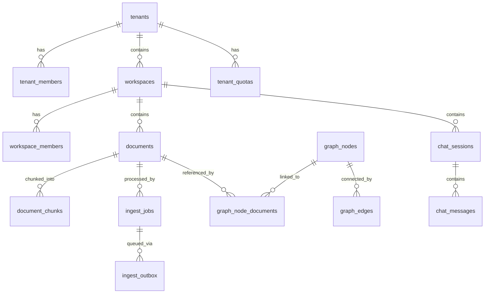

### Mô tả từng bảng

| Bảng | Mô tả | Cột quan trọng |
|---|---|---|
| `tenants` | Thông tin tenant | `id`, `name`, `status` |
| `tenant_members` | Thành viên của tenant | `tenant_id`, `user_id`, `role` |
| `workspaces` | Không gian làm việc trong tenant | `id`, `tenant_id`, `name` |
| `workspace_members` | Thành viên workspace | `workspace_id`, `user_id`, `role` |
| `documents` | Tài liệu được upload | `id`, `tenant_id`, `workspace_id`, `status`, `s3_key`, `size_bytes` |
| `document_chunks` | Đoạn văn bản được chunk | `id`, `document_id`, `chunk_index`, `content`, `qdrant_point_id`, **`page_start`**, **`page_end`** |
| `ingest_jobs` | Job xử lý ingest | `id`, `document_id`, `status`, `claimed_at`, `last_error`, `attempt_count` |
| **`ingest_outbox`** *(T84D mới)* | Outbox relay jobs sang Redis | `id`, `tenant_id`, `document_id`, `payload_json`, `dispatched` |
| `graph_nodes` | Node đồ thị tri thức | `id`, `tenant_id`, `workspace_id`, `kind`, `label`, `description`, `qdrant_point_id` |
| `graph_edges` | Cạnh đồ thị | `id`, `source_node_id`, `target_node_id`, `relation`, `weight` |
| **`graph_node_documents`** *(T84D mới)* | Provenance: node ↔ document | `graph_node_id`, `document_id` |
| `chat_sessions` | Phiên chat | `id`, `tenant_id`, `workspace_id`, `user_id` |
| `chat_messages` | Tin nhắn trong phiên | `id`, `session_id`, `role`, `content`, `created_at` |
| `relation_tuples` | ReBAC permissions | `namespace`, `object_id`, `relation`, `principal` |
| `llm_settings` | Cấu hình LLM per tenant | `tenant_id`, `provider`, `model`, `api_key_encrypted` |
| `tenant_quotas` | Giới hạn sử dụng | `tenant_id`, `max_storage_bytes`, `max_documents` |
| `usage_events` | Sự kiện sử dụng (billing) | `tenant_id`, `event_type`, `quantity`, `created_at` |
| `audit_logs` | Nhật ký kiểm toán | `tenant_id`, `user_id`, `action`, `resource`, `created_at` |

### Trạng thái Document

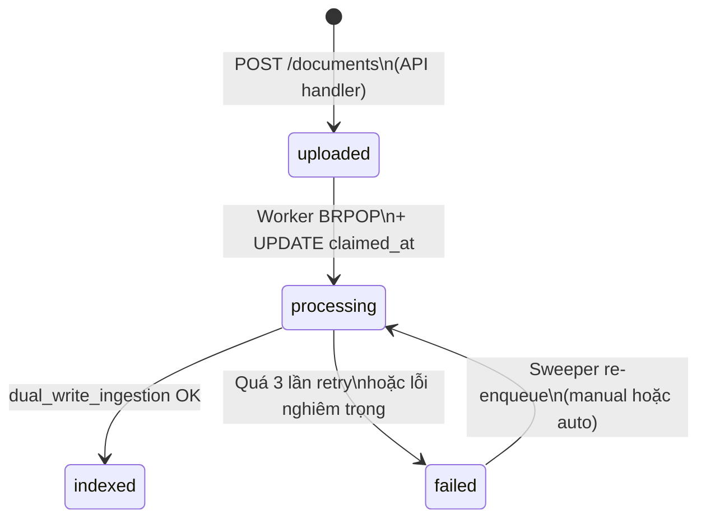

---

## 10. Tech Stack & Dependencies

### Backend

| Công nghệ | Phiên bản khuyến nghị | Vai trò |
|---|---|---|
| **Rust** | stable (1.77+) | Ngôn ngữ lập trình chính |
| **Axum** | 0.7.x | HTTP framework, SSE support |
| **Tokio** | 1.x | Async runtime |
| **sqlx** | 0.7.x | PostgreSQL async driver, compile-time query check |
| **qdrant-client** | latest | Qdrant Rust SDK |
| **redis** | 0.25.x | Redis async client |
| **aws-sdk-s3** | latest | S3/MinIO client |
| **serde / serde_json** | 1.x | JSON serialization |
| **tiktoken-rs** | latest | cl100k tokenizer cho chunking |

### Infrastructure

| Dịch vụ | Phiên bản | Cấu hình đáng chú ý |
|---|---|---|
| **PostgreSQL** | 15+ | RLS bật, extension `pgcrypto` nếu cần |
| **Qdrant** | 1.8+ | `--service-grpc-port` cho gRPC |
| **Redis** | 7+ | Không cần persistence (queue tạm thời) |
| **MinIO** | latest | S3-compatible, lifecycle policy cho cleanup |
| **Ollama** | latest | Local LLM server |
| **Keycloak** | 22+ | OIDC provider, realm per deployment |

### LLM Providers

| Provider | Loại | Ghi chú |
|---|---|---|
| **Ollama** | Local | Chạy model on-premise, không cần internet |
| **DeepSeek** | Remote BYOK | API key do tenant cung cấp (Bring Your Own Key), được mã hóa trong DB |

---

## 11. Các Hằng Số Hệ Thống

### Chunking & Embedding

| Hằng số | Giá trị | Mô tả |
|---|---|---|
| `CHUNK_SIZE_TOKENS` | **1200** | Kích thước chunk (tokens, cl100k) |
| `CHUNK_OVERLAP_TOKENS` | **100** | Số token overlap giữa 2 chunk liền kề |
| `EMBED_DIM` | **768** | Số chiều vector embedding |
| `DEFAULT_BATCH_SIZE` | **32** | Số chunk trong một embedding batch |

### Ingest & Retry

| Hằng số | Giá trị | Mô tả |
|---|---|---|
| `MAX_ATTEMPTS` | **3** | Số lần retry tối đa cho ingest job |
| `PDF_PARSE_TIMEOUT_SECS` | **30** | Timeout parse PDF (giây) |
| `GMRAG_OUTBOX_POLL_INTERVAL_SECS` | **3** | Tần suất relay poll outbox (giây) |
| `GMRAG_SWEEP_INTERVAL_SECS` | **60** | Tần suất sweeper kiểm tra stuck jobs (giây) |
| `POLL_TIMEOUT_SECS` | **5** | Timeout BRPOP của worker (giây) |

**Exponential backoff schedule:**

| Lần retry | Thời gian chờ |
|---|---|
| Sau lần 1 | 1 giây |
| Sau lần 2 | 2 giây |
| Sau lần 3 | 4 giây |
| *(nếu có)* | 8s → 16s → ... |

### Retrieval & RAG

| Hằng số | Giá trị | Mô tả |
|---|---|---|
| `DEFAULT_TOP_K` | **5** | Số chunk kết quả trả về từ Qdrant search |
| `GRAPH_SCORE_THRESHOLD` | **0.25** | Ngưỡng score tối thiểu cho graph node search |
| `GMRAG_CHAT_HISTORY_LIMIT` | **10** | Số tin nhắn cũ load vào context |

### API & Storage

| Hằng số | Giá trị | Mô tả |
|---|---|---|
| Upload body limit | **50 MiB** | Kích thước file tối đa cho một lần upload |
| Redis queue key | `gmrag:ingest_jobs` | Key của list queue trên Redis |
| `DEFAULT_GRAPH_PAGE_LIMIT` | **200** | Số node mặc định cho Graph API pagination |
| `MAX_GRAPH_PAGE_LIMIT` | **500** | Số node tối đa cho một page Graph API |

---

## Phụ lục: Biến Môi Trường Quan Trọng

| Biến | Default | Mô tả |
|---|---|---|
| `GMRAG_OUTBOX_POLL_INTERVAL_SECS` | `3` | Tần suất relay poll `ingest_outbox` |
| `GMRAG_SWEEP_INTERVAL_SECS` | `60` | Tần suất sweeper kiểm tra stuck jobs |
| `GMRAG_CHAT_HISTORY_LIMIT` | `10` | Số tin nhắn lịch sử đưa vào context |
| `DATABASE_URL` | — | PostgreSQL connection string |
| `QDRANT_URL` | — | Qdrant server URL |
| `REDIS_URL` | — | Redis connection string |
| `S3_BUCKET` | — | Tên bucket S3/MinIO |
| `S3_ENDPOINT` | — | Endpoint S3/MinIO (nếu dùng MinIO) |
| `OIDC_ISSUER` | — | OIDC issuer URL (Keycloak realm) |

---

*Tài liệu này được tạo tự động từ thông tin kỹ thuật của dự án GMRAG 2.0. Khi có thay đổi kiến trúc, vui lòng cập nhật tài liệu này đồng thời với code.*
